# M2SmartHome

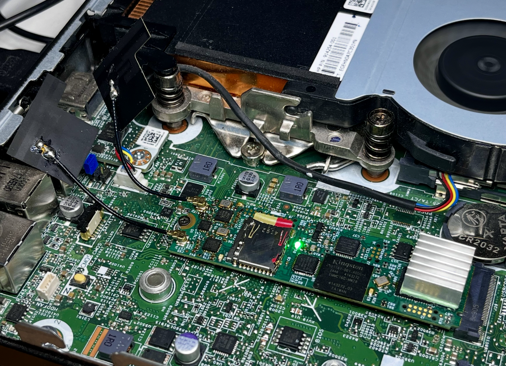

## Overview

Setting up a smart home hub, such as running Home Assistant, often requires hardware with sufficient performance and connectivity options. Many existing solutions, like Raspberry Pi, may be insufficient for advanced automation tasks due to a low-power CPU or a slow microSD card on which the OS is installed. A good alternative could be an x86 mini PC, but these often lack expansion ports.  

M2SmartHome is an add-on card that operates on PCIe 2.0 x1 and can be installed in any M.2 2280 Key M-equipped device. By integrating multiple essential components into a single device, it eliminates the need for external adapters and additional hardware.  

The device is equipped with onboard eMMC memory, an SD card reader, WiFi 802.11n 2.4GHz radio (RTL8188), and a Thread radio (EFR32) from Silicon Labs. Once installed in an M.2 slot, it provides both storage for the operating system and enhanced connectivity, making it an ideal choice for smart home setups.

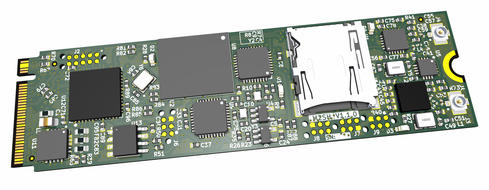
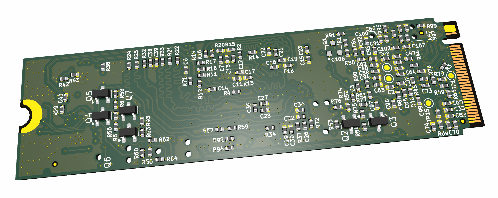


## Features

- **Form Factor**: M.2 2280 Key M
- **Interface**: M.2 edge conenctor PCIe 2.0 x1 
- **Storage**: Onboard 16GB eMMC, micro SD card reader
- **Wireless Connectivity**:
  - **WiFi**: 802.11n 2.4GHz (Realtek RTL8188)
  - **Thread Radio**: EFR32MG21 (Silicon Labs)


## Block diagram

On the diagram below siplified system architecture has been presented. PCIe 2.0 x1 interface from host device is connected to PCIe bridge. To four USB 2.0 ports all crucial components are connected: eMMC memory controller, micro SD card controller, USB to UART bridge with Thread / ZigBee RF SOC and WiFi network card. 


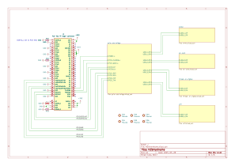


### PCie to USB bridge
As a PCIe bridge choosen the `TUSB7340` manufactured by Texas Instruments. `TUSB7340` is a PCIe-to-USB 3.0 host controller with a single line  PCIe interface, compliant with the PCIe  Specification 2.0, supporting programmable driver current, de-emphasis levels, and advanced power management (L0, L0s, L1, L2, L2/L3Ready, L3, D0, D3Hot, D3Cold). It features four USB 3.0 ports as well as USB 2.0 data lines with EHCI (480 Mbps) and OHCI (12 Mbps, 1.5 Mbps) controllers for high-, full-, and low-speed transactions. An EEPROM connected via I²C has been added to enable optional features and configurable settings. Additionally TagConnect TC2030 6-pin connector has been added for flashing I²C EEPROM and TC2050 10-pin connector for accesing `TUSB7340` JTAG.


Components related to this part of the schematic has been highlighted in green on the board view:

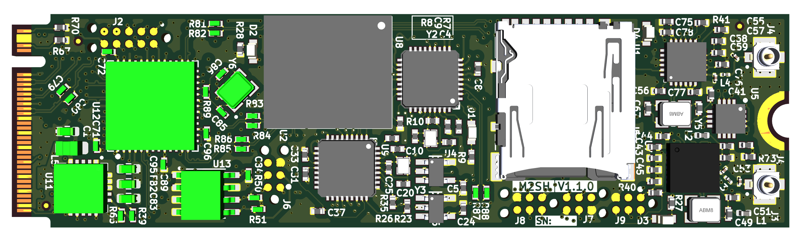
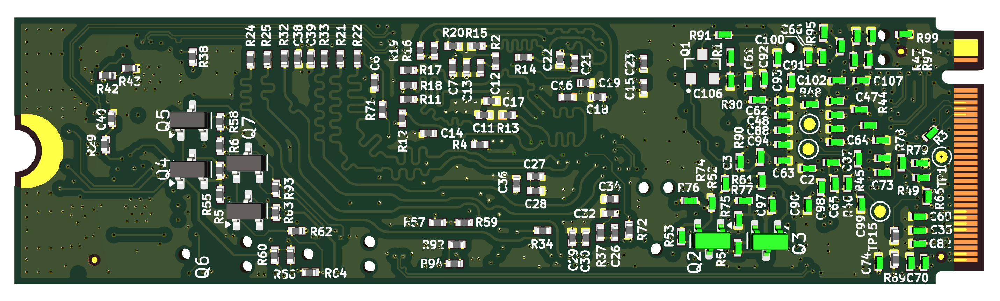

### eMMC memory with controller

The `USB2244` is connected to a `TUSB7340` PCIe-to-USB bridge, acting as a USB 2.0-to-eMMC controller for Kingston’s `EMMC16G-MW28-01E10`, with a Microchip `24AA04T-I/OT` EEPROM for optional configuration. The eMMC is powered directly from the M.2 3.3V rail, eliminating the need for an LDO. The eMMC interface uses D0–D8, CMD, and CLK lines, with 49.9kΩ pull-ups on CMD and data lines. The EEPROM is connected via I²C (SCL, SDA) with 4.7kΩ pull-ups, storing configuration settings for the USB controller. This setup provides high-speed eMMC access over USB in an M.2 form factor.


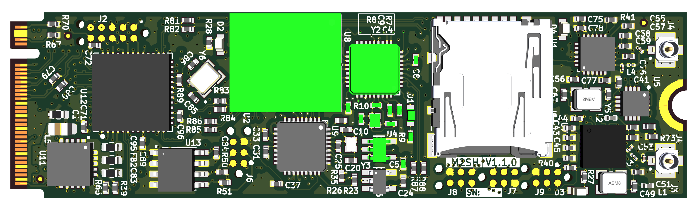
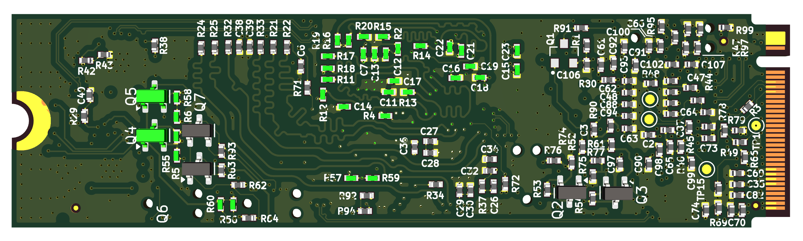

### micro SD card reader and controller

The `USB2244` controller interfaces with a Hirose `DM3AT-SF-PEJM5` push-push microSD card slot and with a Microchip `24AA04T-I/OT` EEPROM for configuration storage. The microSD card is powered by the internal 3.3V regulator of the `USB2244`. The SD interface utilizes CLK, CMD, and D0–D3 lines, with 49.9kΩ pull-ups on CMD and data lines for stable operation. The EEPROM is connected via I²C (SCL, SDA) with 4.7kΩ pull-ups, allowing the `USB2244` to load stored device settings at startup. Additionaly TagConnect TC2030 


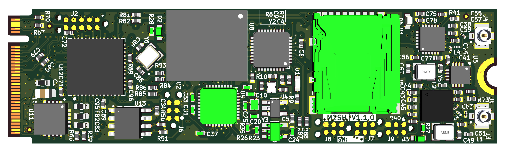
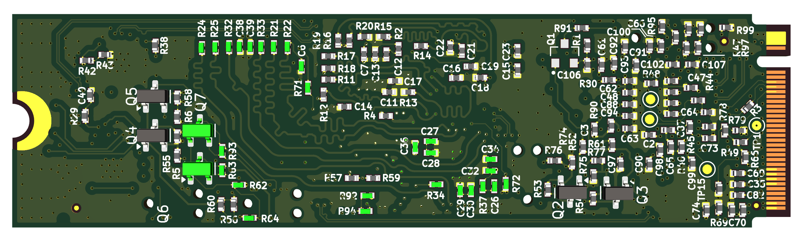

### Thread radio

The Silicon Labs EFR32MG21B020F1024IM32-B is a 802.15.4 Thread radio SoC, providing wireless connectivity, while the Silicon Labs CP2102N-A02-GQFN20 acts as a USB-to-UART bridge for communication with a host system. The EFR32MG21 is powered from the M.2 3.3V rail, with its radio interface using an external antenna for Thread communication. The CP2102N is connected via USB 2.0 (D+, D-) to the host via PCIe USB bridge. 


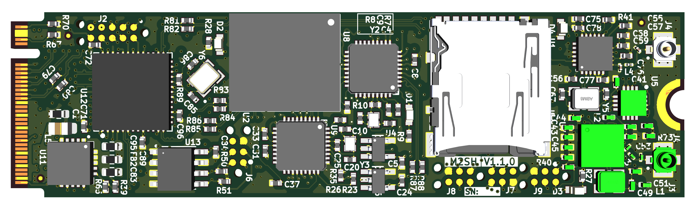


### WiFi radio

The Realtek RTL8188FTV-VC-CG is a WiFi 802.11b/g/n 2.4GHz radio SoC, providing wireless connectivity. It is powered from the M.2 3.3V rail and interfaces with the host system via a USB 2.0 connection. The RF section is connected to an external antenna. 


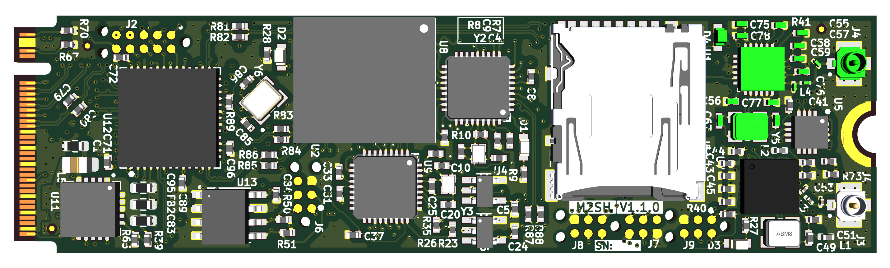
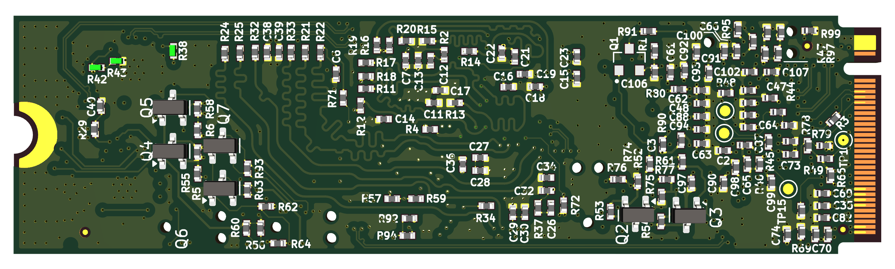

## Manufacturing

The PCB was manufactured by JLCPCB, using Gerber files generated by the CI job `kicad_release_CI.yml`. The board features a 6-layer design with the standard stack-up `JLC06081H-2116`.

While the board includes a few high-speed signals, such as USB 2.0 and PCIe 2.0, these interfaces are relatively tolerant of signal integrity variations. As a result, impedance maps were not created for this design.

All PCB order settings are detailed below.


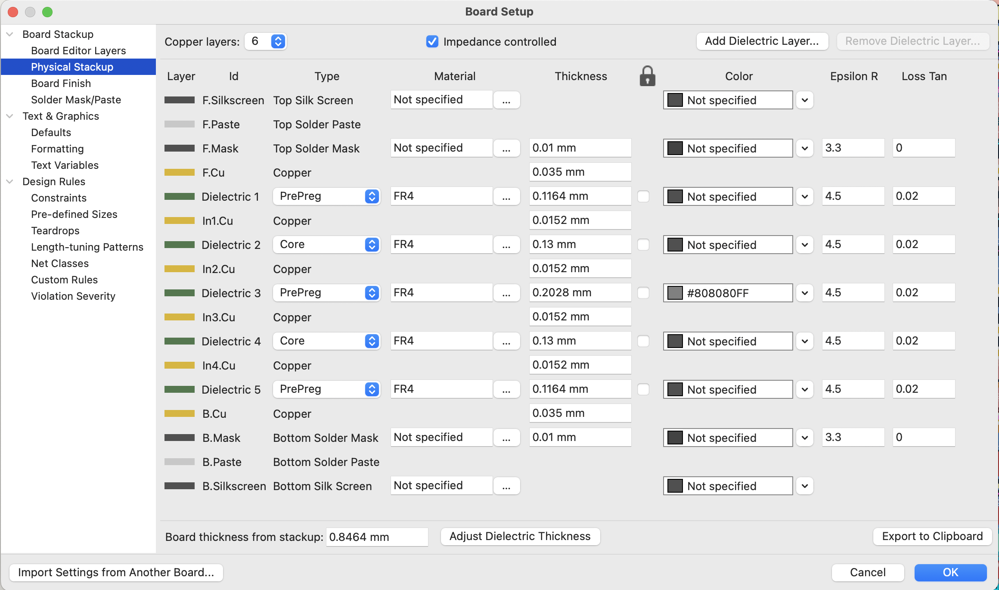

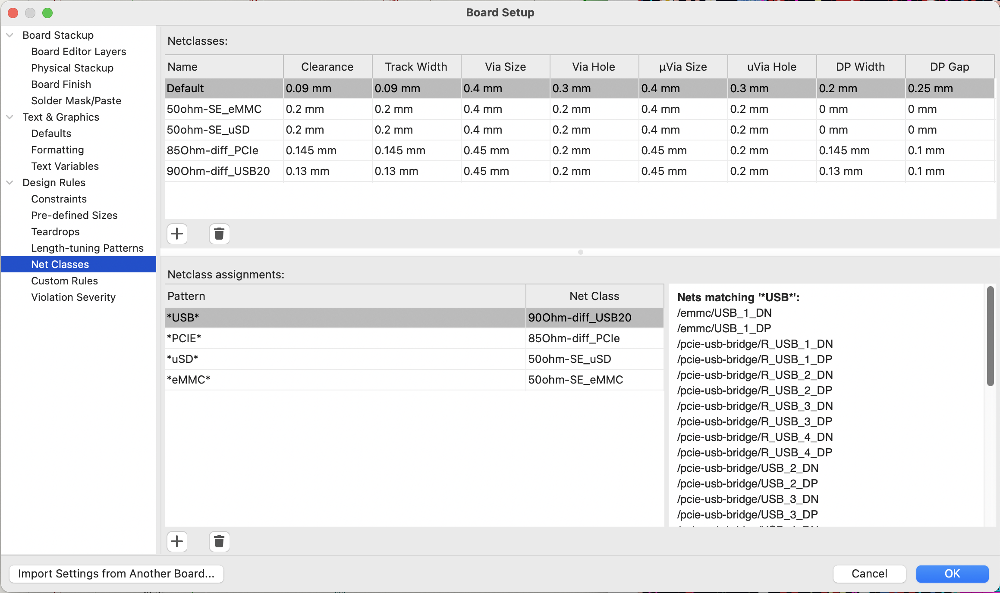

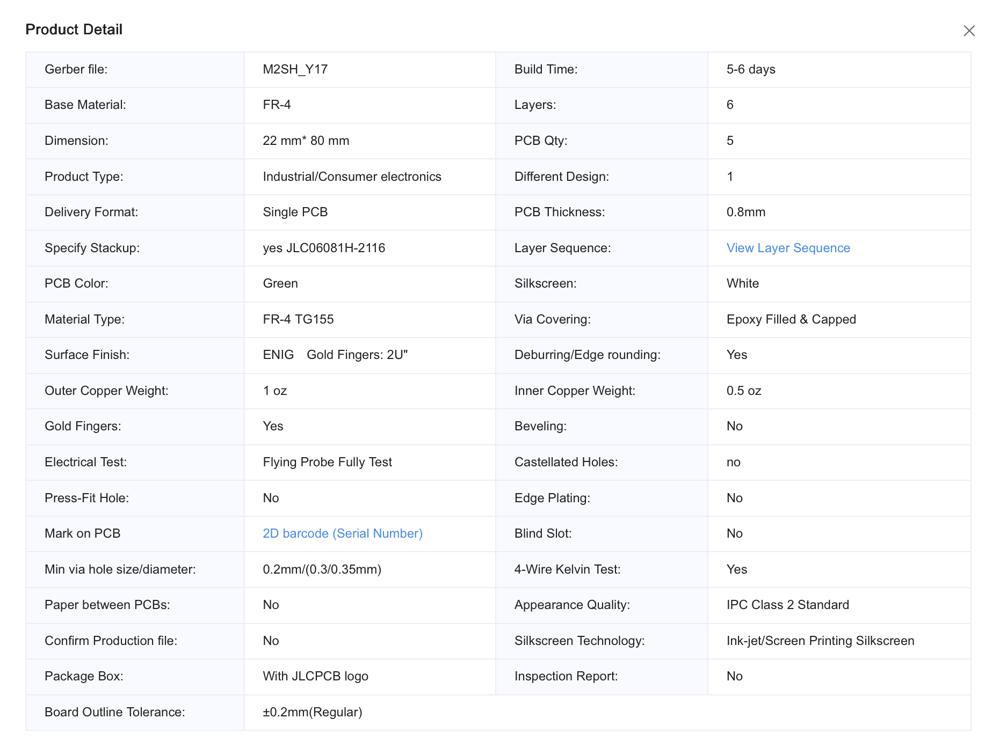

Components were sourced via the Octopart API, with OEMSecrets used to optimize the Bill of Materials (BOM) cost. For assembly, SN42Bi58 low-temperature solder paste was applied, and all components were manually placed using tweezers.

The top side of the board was soldered using a UYUE 946C hotplate, with a preheat stage of 1 minute at 100 °C followed by a 2-minute reflow up to 330 °C. The bottom side was soldered using a preheater set to 100 °C and a hot air gun set to 360 °C.


## Required modifications

Rev.1.1.0 is not flawless, a few moodifications are required

- Q5 transistor Drain and Source swap places
- U7 pin 24 decouple connection cut from 3V3
- Add connection U5 RTS pin to U6 PB00 pin 16
- Add connection U5 CTS pin to U6 PB01 pin 15

## Board bring up 

Board bringup starts with visual inspecion, completion check, as well as DNP components check. Removed all shorts and corrected invidual components using soldering iron. 

First powering up - using lab bench power supply connected to +3V3 power bus, with current limit set to 400 mA. 

### Auxilary equipment used for test 

All tests were performed using x86 architecture 64 bit computer. In this case HP EliteDesk 800 G3 USFF. All tests performed using Ubuntu 24.04 LTS. For testing thread and wifi used `LXC LXC1BL4820240722009` 2.4 GHz tuned antennas. 

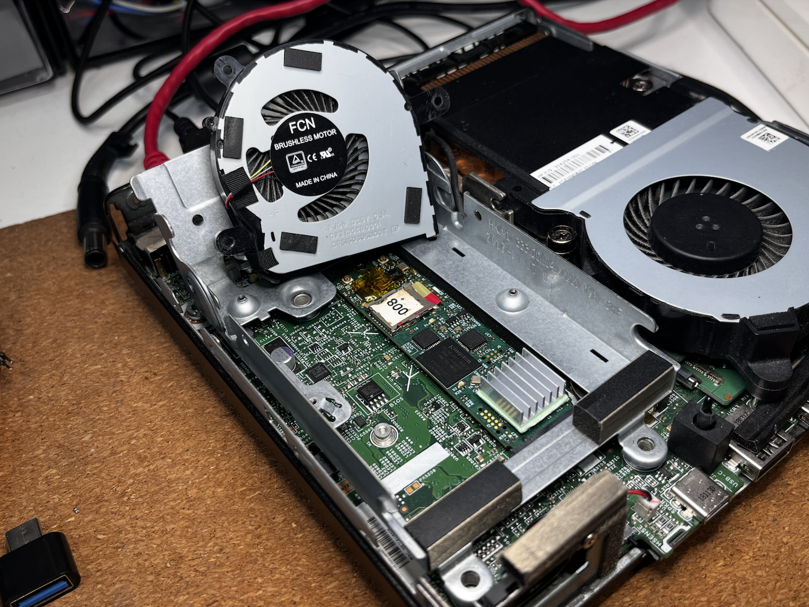

### PCie USB bridge

After turning on PC, after operating system loads, when prompted in terminal `sudo lspci -vvv | grep -A 80 TUSB`, verbose output of the `lspci` should looks like below. If so PCIe bridge is working and properly detected by the host. 

```bash                                                             
01:00.0 USB controller: Texas Instruments TUSB73x0 SuperSpeed USB 3.0 xHCI Host Controller (rev 02) (prog-if 30 [XHCI])
        Control: I/O- Mem+ BusMaster+ SpecCycle- MemWINV- VGASnoop- ParErr- Stepping- SERR+ FastB2B- DisINTx+                                                                                                                                                                                                         
        Status: Cap+ 66MHz- UDF- FastB2B- ParErr- DEVSEL=fast >TAbort- <TAbort- <MAbort- >SERR- <PERR- INTx-
        Latency: 0, Cache Line Size: 64 bytes
        Interrupt: pin A routed to IRQ 16
        Region 0: Memory at ce900000 (64-bit, non-prefetchable) [size=64K]
        Region 2: Memory at ce910000 (64-bit, non-prefetchable) [size=8K]
        Capabilities: [40] Power Management version 3
                Flags: PMEClk- DSI- D1+ D2+ AuxCurrent=0mA PME(D0+,D1+,D2+,D3hot+,D3cold-)
                Status: D0 NoSoftRst+ PME-Enable- DSel=0 DScale=0 PME-
        Capabilities: [48] MSI: Enable- Count=1/8 Maskable- 64bit+
                Address: 0000000000000000  Data: 0000
        Capabilities: [70] Express (v2) Endpoint, MSI 00
                DevCap: MaxPayload 1024 bytes, PhantFunc 0, Latency L0s unlimited, L1 unlimited
                        ExtTag- AttnBtn- AttnInd- PwrInd- RBE+ FLReset- SlotPowerLimit 25W
                DevCtl: CorrErr+ NonFatalErr+ FatalErr+ UnsupReq+
                        RlxdOrd+ ExtTag- PhantFunc- AuxPwr- NoSnoop-
                        MaxPayload 256 bytes, MaxReadReq 512 bytes
                DevSta: CorrErr- NonFatalErr- FatalErr- UnsupReq- AuxPwr- TransPend-
                LnkCap: Port #0, Speed 5GT/s, Width x1, ASPM L0s L1, Exit Latency L0s <512ns, L1 <64us
                        ClockPM+ Surprise- LLActRep- BwNot- ASPMOptComp-
                LnkCtl: ASPM L0s L1 Enabled; RCB 64 bytes, Disabled- CommClk+
                        ExtSynch- ClockPM+ AutWidDis- BWInt- AutBWInt-
                LnkSta: Speed 5GT/s, Width x1
                        TrErr- Train- SlotClk+ DLActive- BWMgmt- ABWMgmt-
                DevCap2: Completion Timeout: Not Supported, TimeoutDis+ NROPrPrP- LTR-
                         10BitTagComp- 10BitTagReq- OBFF Not Supported, ExtFmt- EETLPPrefix-
                         EmergencyPowerReduction Not Supported, EmergencyPowerReductionInit-
                         FRS- TPHComp- ExtTPHComp-
                         AtomicOpsCap: 32bit- 64bit- 128bitCAS-
                DevCtl2: Completion Timeout: 50us to 50ms, TimeoutDis- LTR- 10BitTagReq- OBFF Disabled,
                         AtomicOpsCtl: ReqEn-
                LnkCtl2: Target Link Speed: 5GT/s, EnterCompliance- SpeedDis-
                         Transmit Margin: Normal Operating Range, EnterModifiedCompliance- ComplianceSOS-
                         Compliance Preset/De-emphasis: -6dB de-emphasis, 0dB preshoot
                LnkSta2: Current De-emphasis Level: -6dB, EqualizationComplete- EqualizationPhase1-
                         EqualizationPhase2- EqualizationPhase3- LinkEqualizationRequest-
                         Retimer- 2Retimers- CrosslinkRes: unsupported
        Capabilities: [c0] MSI-X: Enable+ Count=8 Masked-
                Vector table: BAR=2 offset=00000000
                PBA: BAR=2 offset=00001000
        Capabilities: [100 v2] Advanced Error Reporting
                UESta:  DLP- SDES- TLP- FCP- CmpltTO- CmpltAbrt- UnxCmplt- RxOF- MalfTLP- ECRC- UnsupReq- ACSViol-
                UEMsk:  DLP- SDES- TLP- FCP- CmpltTO- CmpltAbrt- UnxCmplt- RxOF- MalfTLP- ECRC- UnsupReq- ACSViol-
                UESvrt: DLP+ SDES+ TLP- FCP+ CmpltTO- CmpltAbrt- UnxCmplt- RxOF+ MalfTLP+ ECRC- UnsupReq- ACSViol-
                CESta:  RxErr- BadTLP- BadDLLP- Rollover- Timeout- AdvNonFatalErr-
                CEMsk:  RxErr- BadTLP- BadDLLP- Rollover- Timeout- AdvNonFatalErr+
                AERCap: First Error Pointer: 00, ECRCGenCap+ ECRCGenEn- ECRCChkCap+ ECRCChkEn-
                        MultHdrRecCap- MultHdrRecEn- TLPPfxPres- HdrLogCap-
                HeaderLog: 00000000 00000000 00000000 00000000
        Capabilities: [150 v1] Device Serial Number 08-00-28-00-00-20-00-00
        Kernel driver in use: xhci_hcd
        Kernel modules: xhci_pci
```

Additionally also USB HUB should be visible. When prompted `sudo lsusb -vvv | grep -A 80 TUSB` operating system should return similar config to seen below.

```bash
01:00.0 USB controller [0c03]: Texas Instruments TUSB73x0 SuperSpeed USB 3.0 xHCI Host Controller [104c:8241] (rev 02) (prog-if 30 [XHCI])
	Control: I/O- Mem+ BusMaster+ SpecCycle- MemWINV- VGASnoop- ParErr- Stepping- SERR+ FastB2B- DisINTx+
	Status: Cap+ 66MHz- UDF- FastB2B- ParErr- DEVSEL=fast >TAbort- <TAbort- <MAbort- >SERR- <PERR- INTx-
	Latency: 0, Cache Line Size: 64 bytes
	Interrupt: pin A routed to IRQ 16
	Region 0: Memory at ce900000 (64-bit, non-prefetchable) [size=64K]
	Region 2: Memory at ce910000 (64-bit, non-prefetchable) [size=8K]
	Capabilities: [40] Power Management version 3
		Flags: PMEClk- DSI- D1+ D2+ AuxCurrent=0mA PME(D0+,D1+,D2+,D3hot+,D3cold-)
		Status: D0 NoSoftRst+ PME-Enable- DSel=0 DScale=0 PME-
	Capabilities: [48] MSI: Enable- Count=1/8 Maskable- 64bit+
		Address: 0000000000000000  Data: 0000
	Capabilities: [70] Express (v2) Endpoint, MSI 00
		DevCap:	MaxPayload 1024 bytes, PhantFunc 0, Latency L0s unlimited, L1 unlimited
			ExtTag- AttnBtn- AttnInd- PwrInd- RBE+ FLReset- SlotPowerLimit 25W
		DevCtl:	CorrErr+ NonFatalErr+ FatalErr+ UnsupReq+
			RlxdOrd+ ExtTag- PhantFunc- AuxPwr- NoSnoop-
			MaxPayload 256 bytes, MaxReadReq 512 bytes
		DevSta:	CorrErr- NonFatalErr- FatalErr- UnsupReq- AuxPwr- TransPend-
		LnkCap:	Port #0, Speed 5GT/s, Width x1, ASPM L0s L1, Exit Latency L0s <512ns, L1 <64us
			ClockPM+ Surprise- LLActRep- BwNot- ASPMOptComp-
		LnkCtl:	ASPM L0s L1 Enabled; RCB 64 bytes, Disabled- CommClk+
			ExtSynch- ClockPM+ AutWidDis- BWInt- AutBWInt-
		LnkSta:	Speed 5GT/s, Width x1
			TrErr- Train- SlotClk+ DLActive- BWMgmt- ABWMgmt-
		DevCap2: Completion Timeout: Not Supported, TimeoutDis+ NROPrPrP- LTR-
			 10BitTagComp- 10BitTagReq- OBFF Not Supported, ExtFmt- EETLPPrefix-
			 EmergencyPowerReduction Not Supported, EmergencyPowerReductionInit-
			 FRS- TPHComp- ExtTPHComp-
			 AtomicOpsCap: 32bit- 64bit- 128bitCAS-
		DevCtl2: Completion Timeout: 50us to 50ms, TimeoutDis- LTR- 10BitTagReq- OBFF Disabled,
			 AtomicOpsCtl: ReqEn-
		LnkCtl2: Target Link Speed: 5GT/s, EnterCompliance- SpeedDis-
			 Transmit Margin: Normal Operating Range, EnterModifiedCompliance- ComplianceSOS-
			 Compliance Preset/De-emphasis: -6dB de-emphasis, 0dB preshoot
		LnkSta2: Current De-emphasis Level: -6dB, EqualizationComplete- EqualizationPhase1-
			 EqualizationPhase2- EqualizationPhase3- LinkEqualizationRequest-
			 Retimer- 2Retimers- CrosslinkRes: unsupported
	Capabilities: [c0] MSI-X: Enable+ Count=8 Masked-
		Vector table: BAR=2 offset=00000000
		PBA: BAR=2 offset=00001000
	Capabilities: [100 v2] Advanced Error Reporting
		UESta:	DLP- SDES- TLP- FCP- CmpltTO- CmpltAbrt- UnxCmplt- RxOF- MalfTLP- ECRC- UnsupReq- ACSViol-
		UEMsk:	DLP- SDES- TLP- FCP- CmpltTO- CmpltAbrt- UnxCmplt- RxOF- MalfTLP- ECRC- UnsupReq- ACSViol-
		UESvrt:	DLP+ SDES+ TLP- FCP+ CmpltTO- CmpltAbrt- UnxCmplt- RxOF+ MalfTLP+ ECRC- UnsupReq- ACSViol-
		CESta:	RxErr- BadTLP- BadDLLP- Rollover- Timeout- AdvNonFatalErr-
		CEMsk:	RxErr- BadTLP- BadDLLP- Rollover- Timeout- AdvNonFatalErr+
		AERCap:	First Error Pointer: 00, ECRCGenCap+ ECRCGenEn- ECRCChkCap+ ECRCChkEn-
			MultHdrRecCap- MultHdrRecEn- TLPPfxPres- HdrLogCap-
		HeaderLog: 00000000 00000000 00000000 00000000
	Capabilities: [150 v1] Device Serial Number 08-00-28-00-00-20-00-00
	Kernel driver in use: xhci_hcd
	Kernel modules: xhci_pci
```

Additionally may read PCIe config in pure hex form (`sudo lspci -s 01:00 -xxx`) which can be usefull for customization of the controller setting as it directly reflects memory adresses in I2C EEPROM connected to it.
```bash
01:00.0 USB controller: Texas Instruments TUSB73x0 SuperSpeed USB 3.0 xHCI Host Controller (rev 02)
00: 4c 10 41 82 06 05 10 00 02 30 03 0c 10 00 00 00
10: 04 00 90 ce 00 00 00 00 04 00 91 ce 00 00 00 00
20: 00 00 00 00 00 00 00 00 00 00 00 00 00 00 00 00
30: 00 00 00 00 40 00 00 00 00 00 00 00 ff 01 00 00
40: 01 48 03 7e 08 00 00 00 05 70 86 00 00 00 00 00
50: 00 00 00 00 00 00 00 00 00 00 00 00 00 00 00 00
60: 30 20 00 00 00 00 00 00 00 00 00 00 00 00 00 00
70: 10 c0 02 00 c3 8f e8 07 3f 20 00 00 12 3c 07 00
80: 43 01 12 10 00 00 00 00 00 00 00 00 00 00 00 00
90: 00 00 00 00 10 00 00 00 00 00 00 00 00 00 00 00
a0: 02 00 00 00 00 00 00 00 00 00 00 00 00 00 00 00
b0: 00 00 00 00 00 00 0f 00 00 00 00 00 00 00 00 00
c0: 11 00 07 80 02 00 00 00 02 10 00 00 00 00 00 00
d0: 00 00 00 00 ab 0d 00 00 1b 00 00 00 3f 00 00 00
e0: 00 00 00 00 00 00 00 00 00 00 00 00 00 00 00 00
f0: 00 00 00 00 00 00 00 00 00 00 00 00 00 00 00 00
```

Last check is in a tree form if all four USB devices connected to the hub are visible (`sudo lsusb -vt`). 
```bash
/:  Bus 003.Port 001: Dev 001, Class=root_hub, Driver=xhci_hcd/4p, 480M
    ID 1d6b:0002 Linux Foundation 2.0 root hub
    |__ Port 001: Dev 002, If 0, Class=Vendor Specific Class, Driver=rtl8xxxu, 480M
        ID 0bda:f179 Realtek Semiconductor Corp. RTL8188FTV 802.11b/g/n 1T1R 2.4G WLAN Adapter
    |__ Port 002: Dev 003, If 0, Class=Mass Storage, Driver=usb-storage, 480M
        ID 0424:2240 Microchip Technology, Inc. (formerly SMSC) 
    |__ Port 003: Dev 004, If 0, Class=Vendor Specific Class, Driver=cp210x, 12M
        ID 10c4:ea60 Silicon Labs CP210x UART Bridge
    |__ Port 004: Dev 005, If 0, Class=Mass Storage, Driver=usb-storage, 480M
        ID 0424:2240 Microchip Technology, Inc. (formerly SMSC) 
```


### eMMC memory

eMMC controller is connected to fourth port of USB HUB present in PCIe bridge (`sudo lsusb -vt`). Note that exact same chip is used for micro SD card slot, but connected to two.

```bash
/:  Bus 003.Port 001: Dev 001, Class=root_hub, Driver=xhci_hcd/4p, 480M
    ID 1d6b:0002 Linux Foundation 2.0 root hub
    |__ Port 001: Dev 002, If 0, Class=Vendor Specific Class, Driver=rtl8xxxu, 480M
        ID 0bda:f179 Realtek Semiconductor Corp. RTL8188FTV 802.11b/g/n 1T1R 2.4G WLAN Adapter
    |__ Port 002: Dev 003, If 0, Class=Mass Storage, Driver=usb-storage, 480M
        ID 0424:2240 Microchip Technology, Inc. (formerly SMSC) 
    |__ Port 003: Dev 004, If 0, Class=Vendor Specific Class, Driver=cp210x, 12M
        ID 10c4:ea60 Silicon Labs CP210x UART Bridge
    |__ Port 004: Dev 005, If 0, Class=Mass Storage, Driver=usb-storage, 480M
        ID 0424:2240 Microchip Technology, Inc. (formerly SMSC) <---------------------------
```

It's configuration can be read using `lsusb -d 0424:2240 -vvv` and should be similar to the one below.

```bash
Bus 001 Device 008: ID 0424:2240 Microchip Technology, Inc. (formerly SMSC) Ultra Fast Media
Couldn't open device, some information will be missing
Device Descriptor:
bLength 18
bDescriptorType 1
bcdUSB 2.00
bDeviceClass 0 [unknown]
bDeviceSubClass 0 [unknown]
bDeviceProtocol 0
bMaxPacketSize0 64
idVendor 0x0424 Microchip Technology, Inc. (formerly SMSC)
idProduct 0x2240 Ultra Fast Media
bcdDevice 1.98
iManufacturer 1 Generic
iProduct 2 Ultra Fast Media
iSerial 3 000000225001
bNumConfigurations 1
Configuration Descriptor:
bLength 9
bDescriptorType 2
wTotalLength 0x0020
bNumInterfaces 1
bConfigurationValue 1
iConfiguration 0
bmAttributes 0x80
(Bus Powered)
MaxPower 96mA
Interface Descriptor:
bLength 9
bDescriptorType 4
bInterfaceNumber 0
bAlternateSetting 0
bNumEndpoints 2
bInterfaceClass 8 Mass Storage
bInterfaceSubClass 6 SCSI
bInterfaceProtocol 80 Bulk-Only
iInterface 0
Endpoint Descriptor:
bLength 7
bDescriptorType 5
bEndpointAddress 0x02 EP 2 OUT
bmAttributes 2
Transfer Type Bulk
Synch Type None
Usage Type Data
wMaxPacketSize 0x0200 1x 512 bytes
bInterval 1
Endpoint Descriptor:
bLength 7
bDescriptorType 5
bEndpointAddress 0x82 EP 2 IN
bmAttributes 2
Transfer Type Bulk
Synch Type None
Usage Type Data
wMaxPacketSize 0x0200 1x 512 bytes
bInterval 0

```

If eMMC memory connected to controller is seen properly it should be listed as block device `lsblk` with correct memory - something below 16GB.

```bash
NAME MAJ:MIN RM SIZE RO TYPE MOUNTPOINTS
sdb 8:16 1 14.6G 0 disk
```

Additionally, it's recommended to check kernel debug messages during system startup to ensure no errors were reported. This can be done using the command: `sudo dmesg`.

```bash
[ 2402.769465] usb 1-13: new high-speed USB device number 8 using xhci_hcd
[ 2402.902304] usb 1-13: New USB device found, idVendor=0424, idProduct=2240, bcdDevice= 1.98
[ 2402.902327] usb 1-13: New USB device strings: Mfr=1, Product=2, SerialNumber=3
[ 2402.902335] usb 1-13: Product: Ultra Fast Media
[ 2402.902341] usb 1-13: Manufacturer: Generic
[ 2402.902347] usb 1-13: SerialNumber: 000000225001
[ 2402.907570] usb-storage 1-13:1.0: USB Mass Storage device detected
[ 2402.907866] scsi host2: usb-storage 1-13:1.0
[ 2403.963071] scsi 2:0:0:0: Direct-Access Generic Ultra HS-COMBO 1.98 PQ: 0 ANSI: 0
[ 2403.963267] sd 2:0:0:0: Attached scsi generic sg1 type 0
[ 2403.969432] sd 2:0:0:0: [sdb] 30615552 512-byte logical blocks: (15.7 GB/14.6 GiB)
[ 2403.970000] sd 2:0:0:0: [sdb] Write Protect is off
[ 2403.970004] sd 2:0:0:0: [sdb] Mode Sense: 23 00 00 00
[ 2403.970608] sd 2:0:0:0: [sdb] No Caching mode page found
[ 2403.970611] sd 2:0:0:0: [sdb] Assuming drive cache: write through
[ 2403.974170] sd 2:0:0:0: [sdb] Attached SCSI removable disk
```

It is recommended to quickly benchmark the memory using Gnome Disks tool, as inproperly solder may result in lower read/write speeds. The expected average read speed around 33MB/s and average access time below 1 ms. 
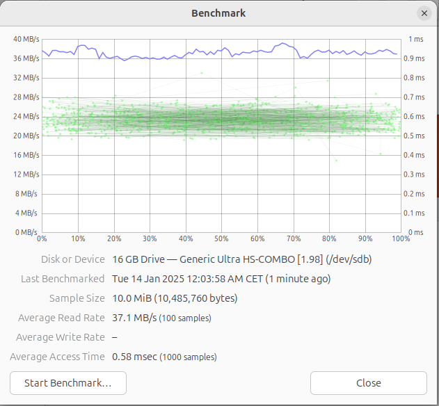

For more detailed benchmark used KDiskMark, which have option to select test file size and generate different write/read patterns beeing closer to more real life scenario. 

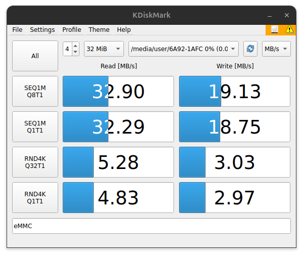

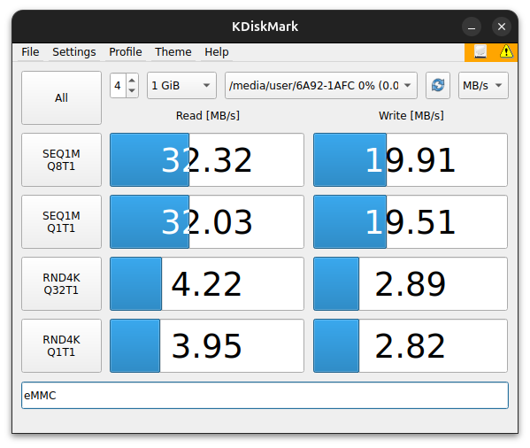


For complete test may use `badblocks` as a extended write/read test which took aproximately 6 hours. Application writes patterns to the entire memory surface and checks if all data has been written correctly. Usage `sudo badblocks -wsv /dev/sdX`
```bash 
Checking for bad blocks in read-write mode
From block 0 to 15307775
Testing with pattern 0xaa: done                                                 
Reading and comparing: done                                                 
Testing with pattern 0x55: done                                                 
Reading and comparing: done                                                 
Testing with pattern 0xff: done                                                 
Reading and comparing: done                                                 
Testing with pattern 0x00: done                                                 
Reading and comparing: done                                                 
Pass completed, 0 bad blocks found. (0/0/0 errors)
```


### uSD reader

uSD controller is connected to second port of USB HUB present in PCIe bridge (`sudo lsusb -vt`).

```bash
/:  Bus 003.Port 001: Dev 001, Class=root_hub, Driver=xhci_hcd/4p, 480M
    ID 1d6b:0002 Linux Foundation 2.0 root hub
    |__ Port 001: Dev 002, If 0, Class=Vendor Specific Class, Driver=rtl8xxxu, 480M
        ID 0bda:f179 Realtek Semiconductor Corp. RTL8188FTV 802.11b/g/n 1T1R 2.4G WLAN Adapter
    |__ Port 002: Dev 003, If 0, Class=Mass Storage, Driver=usb-storage, 480M
        ID 0424:2240 Microchip Technology, Inc. (formerly SMSC) <---------------------------
    |__ Port 003: Dev 004, If 0, Class=Vendor Specific Class, Driver=cp210x, 12M
        ID 10c4:ea60 Silicon Labs CP210x UART Bridge
    |__ Port 004: Dev 005, If 0, Class=Mass Storage, Driver=usb-storage, 480M
        ID 0424:2240 Microchip Technology, Inc. (formerly SMSC) 
```

It's configuration can be read using `lsusb -d 0424:2240 -vvv` and should be similar to the one below.

```bash
Bus 003 Device 003: ID 0424:2240 Microchip Technology, Inc. (formerly SMSC) Ultra Fast Media
Couldn't open device, some information will be missing
Device Descriptor:
bLength 18
bDescriptorType 1
bcdUSB 2.00
bDeviceClass 0 [unknown]
bDeviceSubClass 0 [unknown]
bDeviceProtocol 0
bMaxPacketSize0 64
idVendor 0x0424 Microchip Technology, Inc. (formerly SMSC)
idProduct 0x2240 Ultra Fast Media
bcdDevice 1.98
iManufacturer 1 Generic
iProduct 2 Ultra Fast Media
iSerial 3 000000225001
bNumConfigurations 1
Configuration Descriptor:
bLength 9
bDescriptorType 2
wTotalLength 0x0020
bNumInterfaces 1
bConfigurationValue 1
iConfiguration 0
bmAttributes 0x80
(Bus Powered)
MaxPower 96mA
Interface Descriptor:
bLength 9
bDescriptorType 4
bInterfaceNumber 0
bAlternateSetting 0
bNumEndpoints 2
bInterfaceClass 8 Mass Storage
bInterfaceSubClass 6 SCSI
bInterfaceProtocol 80 Bulk-Only
iInterface 0
Endpoint Descriptor:
bLength 7
bDescriptorType 5
bEndpointAddress 0x02 EP 2 OUT
bmAttributes 2
Transfer Type Bulk
Synch Type None
Usage Type Data
wMaxPacketSize 0x0200 1x 512 bytes
bInterval 1
Endpoint Descriptor:
bLength 7
bDescriptorType 5
bEndpointAddress 0x82 EP 2 IN
bmAttributes 2
Transfer Type Bulk
Synch Type None
Usage Type Data
wMaxPacketSize 0x0200 1x 512 bytes
bInterval 0
```

Insert micro SD card into slot (it is hot pluggable, may be connected when powered on). If uSD memory connected to controller is seen properly it should be listed as block device `lsblk` with correct memory - corresponding to the size of inserted card.

```bash
NAME MAJ:MIN RM SIZE RO TYPE MOUNTPOINTS
sdb 8:16 1 3.7G 0 disk
└─sdb1 8:17 1 3.7G 0 part /media/user/9016-4EF8
```

Additionally, it's recommended to check kernel debug messages during system startup to ensure no errors were reported. This can be done using the command: `sudo dmesg`. Messages with connected just empty reader:
```bash
[ 33.892694] usb 1-13: new high-speed USB device number 5 using xhci_hcd
[ 34.027971] usb 1-13: New USB device found, idVendor=0424, idProduct=2240, bcdDevice= 1.98
[ 34.027977] usb 1-13: New USB device strings: Mfr=1, Product=2, SerialNumber=3
[ 34.027979] usb 1-13: Product: Ultra Fast Media
[ 34.027981] usb 1-13: Manufacturer: Generic
[ 34.027983] usb 1-13: SerialNumber: 000000225001
[ 34.051629] usb-storage 1-13:1.0: USB Mass Storage device detected
[ 34.051918] scsi host2: usb-storage 1-13:1.0
[ 34.052013] usbcore: registered new interface driver usb-storage
[ 34.054051] usbcore: registered new interface driver uas
[ 35.074189] scsi 2:0:0:0: Direct-Access Generic Ultra HS-COMBO 1.98 PQ: 0 ANSI: 0
[ 35.074516] sd 2:0:0:0: Attached scsi generic sg1 type 0
[ 35.075325] sd 2:0:0:0: [sdb] Media removed, stopped polling
[ 35.075721] sd 2:0:0:0: [sdb] Attached SCSI removable disk
```


`dmesg` when inserted 4GB micro SD card:
```bash
[ 651.529877] sd 2:0:0:0: [sdb] 7759872 512-byte logical blocks: (3.97 GB/3.70 GiB)
[ 651.531210] sdb: detected capacity change from 0 to 7759872
[ 651.532979] sdb: sdb1
```

Benchmarked using Gnome Disks tool. Tested 3 different uSD cards. 
  1. Off brand 4GB class 4 micro SD card 
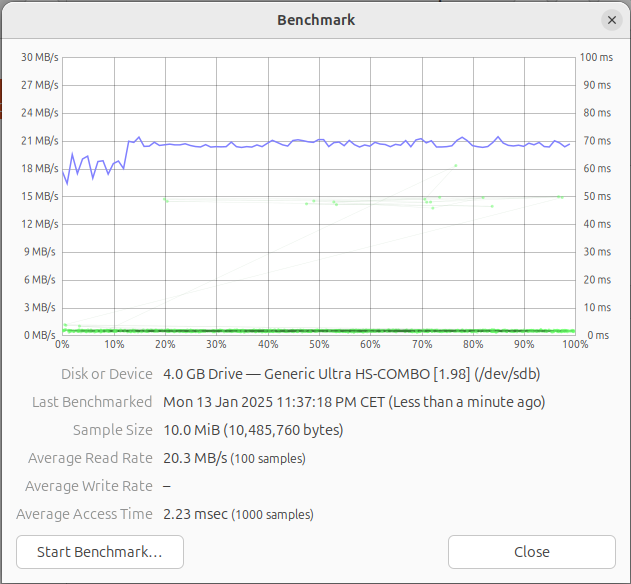

  2. ATP 1GB SLC industrial micro SD card:
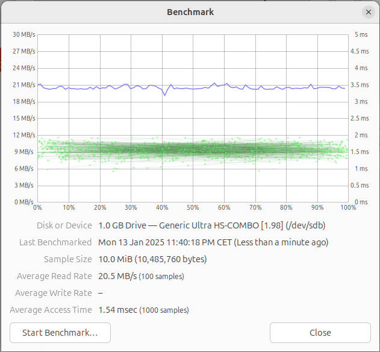

  3. San Disk Extreme 32GB class Ultra 3:
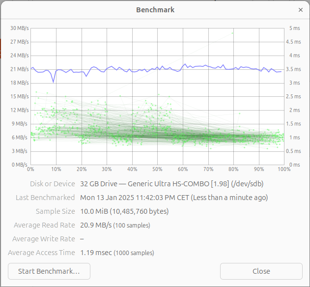

For more detailed benchmark used KDiskMark, which have option to select test file size and generate different write/read patterns beeing closer to more real life scenario. 

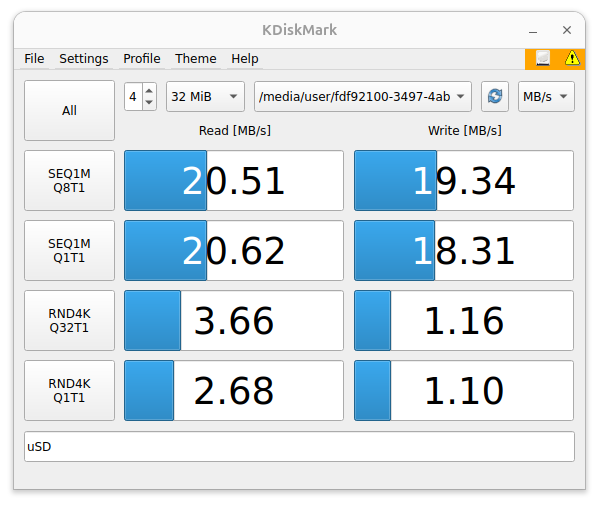

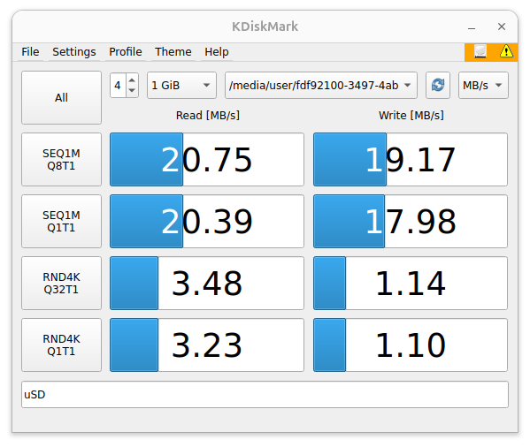

For complete stability test may use `badblocks` as a extended write/read test which took aproximately 6 hours. Application writes patterns to the entire memory surface and checks if all data has been written correctly. Usage `sudo badblocks -wsv /dev/sdX`
```bash
Checking for bad blocks in read-write mode
From block 0 to 31154687
Testing with pattern 0xaa: done                                                 
Reading and comparing: done                                                 
Testing with pattern 0x55: done                                                 
Reading and comparing: done                                                 
Testing with pattern 0xff: done                                                 
Reading and comparing: done                                                 
Testing with pattern 0x00: done                                                 
Reading and comparing: done                                                 
Pass completed, 0 bad blocks found. (0/0/0 errors)
```

### Thread radio

Thread radio consist of two main parts USB UART converter and Thread Radio chip. 

USB UART controller is connected to the third port of USB HUB present in PCIe bridge (`sudo lsusb -vt`).

```bash
/:  Bus 003.Port 001: Dev 001, Class=root_hub, Driver=xhci_hcd/4p, 480M
    ID 1d6b:0002 Linux Foundation 2.0 root hub
    |__ Port 001: Dev 002, If 0, Class=Vendor Specific Class, Driver=rtl8xxxu, 480M
        ID 0bda:f179 Realtek Semiconductor Corp. RTL8188FTV 802.11b/g/n 1T1R 2.4G WLAN Adapter
    |__ Port 002: Dev 003, If 0, Class=Mass Storage, Driver=usb-storage, 480M
        ID 0424:2240 Microchip Technology, Inc. (formerly SMSC) 
    |__ Port 003: Dev 004, If 0, Class=Vendor Specific Class, Driver=cp210x, 12M
        ID 10c4:ea60 Silicon Labs CP210x UART Bridge <---------------------------------------
    |__ Port 004: Dev 005, If 0, Class=Mass Storage, Driver=usb-storage, 480M
        ID 0424:2240 Microchip Technology, Inc. (formerly SMSC) 
```

It's configuration can be read using `lsusb -d 10c4:ea60 -vvv` and should be similar to the one below.

```bash
Bus 003 Device 004: ID 10c4:ea60 Silicon Labs CP210x UART Bridge
Device Descriptor:
  bLength                18
  bDescriptorType         1
  bcdUSB               2.00
  bDeviceClass            0 [unknown]
  bDeviceSubClass         0 [unknown]
  bDeviceProtocol         0 
  bMaxPacketSize0        64
  idVendor           0x10c4 Silicon Labs
  idProduct          0xea60 CP210x UART Bridge
  bcdDevice            1.00
  iManufacturer           1 Silicon Labs
  iProduct                2 CP2102N USB to UART Bridge Controller
  iSerial                 3 9ac4a9c38069ed11b176ea8cedc06881
  bNumConfigurations      1
  Configuration Descriptor:
    bLength                 9
    bDescriptorType         2
    wTotalLength       0x0020
    bNumInterfaces          1
    bConfigurationValue     1
    iConfiguration          0 
    bmAttributes         0x80
      (Bus Powered)
    MaxPower              100mA
    Interface Descriptor:
      bLength                 9
      bDescriptorType         4
      bInterfaceNumber        0
      bAlternateSetting       0
      bNumEndpoints           2
      bInterfaceClass       255 Vendor Specific Class
      bInterfaceSubClass      0 [unknown]
      bInterfaceProtocol      0 
      iInterface              0 
      Endpoint Descriptor:
        bLength                 7
        bDescriptorType         5
        bEndpointAddress     0x02  EP 2 OUT
        bmAttributes            2
can't get device qualifier: Resource temporarily unavailable
can't get debug descriptor: Resource temporarily unavailable
can't get debug descriptor: Resource temporarily unavailable
          Transfer Type            Bulk
          Synch Type               None
          Usage Type               Data
        wMaxPacketSize     0x0040  1x 64 bytes
        bInterval               0
      Endpoint Descriptor:
        bLength                 7
        bDescriptorType         5
        bEndpointAddress     0x82  EP 2 IN
        bmAttributes            2
          Transfer Type            Bulk
          Synch Type               None
          Usage Type               Data
        wMaxPacketSize     0x0040  1x 64 bytes
        bInterval               0
Device Status:     0x0000
  (Bus Powered)
```

For basic check of EFR32MG21 thread radio module have to probe it through SWD. For this test use FTDI FT2232C/H, with 470 ohm resistor between TDI and TDO pins. 
```bash
FTDI                          Target
# ----                          ------
# 1  - Vref   ----------------- Vcc
# 3  - nTRST  -
# 4  - GND    ----------------- GND
# 5  - TDI    ---/\470 Ohm/\--- SWDIO
# 7  - TMS    -
# 9  - TCK    ----------------- SWCLK
# 11 - RTCK   -
# 13 - TDO    ----------------- SWDIO
# 15 - nSRST  - - - - - - - - - nRESET
```
Configuration file for OpenOCD is located in the firmware/thread/OpenOCD folder. For probing use TagConnect TC2030 cable and connect it to J9 port on the PCB. 
Command for probing: `openocd -f ft2232_efr32.cfg -f target/efm32.cfg` (note efm32 is not the desired chip, but this config allows probe of the efr32)
Expected result:
```bash
Open On-Chip Debugger 0.12.0
Licensed under GNU GPL v2
For bug reports, read
	http://openocd.org/doc/doxygen/bugs.html
Info : FTDI SWD mode enabled
cortex_m reset_config sysresetreq

Info : Listening on port 6666 for tcl connections
Info : Listening on port 4444 for telnet connections
Info : clock speed 1000 kHz
Info : SWD DPIDR 0x6ba02477
Info : [efm32.cpu] Cortex-M33 r0p3 processor detected
Info : [efm32.cpu] target has 8 breakpoints, 4 watchpoints
Info : starting gdb server for efm32.cpu on 3333
Info : Listening on port 3333 for gdb connections
Error: [efm32.cpu] clearing lockup after double fault
Polling target efm32.cpu failed, trying to reexamine
Info : [efm32.cpu] Cortex-M33 r0p3 processor detected
Info : [efm32.cpu] target has 8 breakpoints, 4 watchpoints
```

### WiFi radio

`RTL8188` controller is connected to the first port of USB HUB present in PCIe bridge (`sudo lsusb -vt`).

```bash
/:  Bus 003.Port 001: Dev 001, Class=root_hub, Driver=xhci_hcd/4p, 480M
    ID 1d6b:0002 Linux Foundation 2.0 root hub
    |__ Port 001: Dev 002, If 0, Class=Vendor Specific Class, Driver=rtl8xxxu, 480M
        ID 0bda:f179 Realtek Semiconductor Corp. RTL8188FTV 802.11b/g/n 1T1R 2.4G WLAN Adapter <----
    |__ Port 002: Dev 003, If 0, Class=Mass Storage, Driver=usb-storage, 480M
        ID 0424:2240 Microchip Technology, Inc. (formerly SMSC) 
    |__ Port 003: Dev 004, If 0, Class=Vendor Specific Class, Driver=cp210x, 12M
        ID 10c4:ea60 Silicon Labs CP210x UART Bridge 
    |__ Port 004: Dev 005, If 0, Class=Mass Storage, Driver=usb-storage, 480M
        ID 0424:2240 Microchip Technology, Inc. (formerly SMSC) 
```

When listed with `lsusb -d 0bda:f179 -vvv` default config should looks like below.

```bash
Bus 001 Device 054: ID 0bda:f179 Realtek Semiconductor Corp. RTL8188FTV 802.11b/g/n 1T1R 2.4G WLAN Adapter
Couldn't open device, some information will be missing
Device Descriptor:
  bLength                18
  bDescriptorType         1
  bcdUSB               2.00
  bDeviceClass            0 [unknown]
  bDeviceSubClass         0 [unknown]
  bDeviceProtocol         0 
  bMaxPacketSize0        64
  idVendor           0x0bda Realtek Semiconductor Corp.
  idProduct          0xf179 RTL8188FTV 802.11b/g/n 1T1R 2.4G WLAN Adapter
  bcdDevice            0.00
  iManufacturer           1 Realtek
  iProduct                2 802.11n NIC
  iSerial                 3 00E04CB82100
  bNumConfigurations      1
  Configuration Descriptor:
    bLength                 9
    bDescriptorType         2
    wTotalLength       0x0035
    bNumInterfaces          1
    bConfigurationValue     1
    iConfiguration          0 
    bmAttributes         0x80
      (Bus Powered)
    MaxPower              500mA
    Interface Descriptor:
      bLength                 9
      bDescriptorType         4
      bInterfaceNumber        0
      bAlternateSetting       0
      bNumEndpoints           5
      bInterfaceClass       255 Vendor Specific Class
      bInterfaceSubClass    255 Vendor Specific Subclass
      bInterfaceProtocol    255 Vendor Specific Protocol
      iInterface              0 
      Endpoint Descriptor:
        bLength                 7
        bDescriptorType         5
        bEndpointAddress     0x81  EP 1 IN
        bmAttributes            2
          Transfer Type            Bulk
          Synch Type               None
          Usage Type               Data
        wMaxPacketSize     0x0200  1x 512 bytes
        bInterval               0
      Endpoint Descriptor:
        bLength                 7
        bDescriptorType         5
        bEndpointAddress     0x02  EP 2 OUT
        bmAttributes            2
          Transfer Type            Bulk
          Synch Type               None
          Usage Type               Data
        wMaxPacketSize     0x0200  1x 512 bytes
        bInterval               0
      Endpoint Descriptor:
        bLength                 7
        bDescriptorType         5
        bEndpointAddress     0x03  EP 3 OUT
        bmAttributes            2
          Transfer Type            Bulk
          Synch Type               None
          Usage Type               Data
        wMaxPacketSize     0x0200  1x 512 bytes
        bInterval               0
      Endpoint Descriptor:
        bLength                 7
        bDescriptorType         5
        bEndpointAddress     0x04  EP 4 OUT
        bmAttributes            2
          Transfer Type            Bulk
          Synch Type               None
          Usage Type               Data
        wMaxPacketSize     0x0200  1x 512 bytes
        bInterval               0
      Endpoint Descriptor:
        bLength                 7
        bDescriptorType         5
        bEndpointAddress     0x85  EP 5 IN
        bmAttributes            3
          Transfer Type            Interrupt
          Synch Type               None
          Usage Type               Data
        wMaxPacketSize     0x0040  1x 64 bytes
        bInterval               1
```

It is worth to check if device is not throwings any errors `sudo dmesg`.

```bash
[ 4347.746012] usb 1-13: new high-speed USB device number 54 using xhci_hcd
[ 4347.872442] usb 1-13: New USB device found, idVendor=0bda, idProduct=f179, bcdDevice= 0.00
[ 4347.872462] usb 1-13: New USB device strings: Mfr=1, Product=2, SerialNumber=3
[ 4347.872470] usb 1-13: Product: 802.11n NIC
[ 4347.872476] usb 1-13: Manufacturer: Realtek
[ 4347.872482] usb 1-13: SerialNumber: 00E04CB82100
[ 4347.997955] cfg80211: Loading compiled-in X.509 certificates for regulatory database
[ 4347.998132] Loaded X.509 cert 'sforshee: 00b28ddf47aef9cea7'
[ 4347.998277] Loaded X.509 cert 'wens: 61c038651aabdcf94bd0ac7ff06c7248db18c600'
[ 4348.092372] usb 1-13: RTL8188FU rev B (SMIC) romver 0, 1T1R, TX queues 3, WiFi=1, BT=0, GPS=0, HI PA=0
[ 4348.092378] usb 1-13: RTL8188FU MAC: ff:ff:ff:ff:ff:ff
[ 4348.092380] usb 1-13: rtl8xxxu: Loading firmware rtlwifi/rtl8188fufw.bin
[ 4348.093970] usb 1-13: Firmware revision 4.0 (signature 0x88f1)
[ 4349.117854] usbcore: registered new interface driver rtl8xxxu
[ 4349.130891] rtl8xxxu 1-13:1.0 wlxffffffffffff: renamed from wlan0
```

To perform functional test have to connect antenna ended with U.FL. connector to J4 port and assing MAC address to the card. New chip comes unconfigured, having 0xFF values across entire memory map. This results in card beeing not able to connect to any network. To perofm this functional test have to override MAC address in the driver. Note that it is not persistent and after powering off change will dissapear as it has not been written to RTL8188's internal flash. Commands for assiging MAC address:
```bash
sudo ip link set wlxffffffffffff down
sudo ip link set wlxffffffffffff address 12:34:56:78:9A:BC
sudo ip link set wlxffffffffffff up
ip link show wlxffffffffffff 
```

Scan for available networks after modification `sudo iw dev wlxffffffffffff scan`
```bash
BSS c8:bc:c8:fd:91:27(on wlxffffffffffff)
	TSF: 3469783757152 usec (40d, 03:49:43)
	freq: 2412.0
	beacon interval: 100 TUs
	capability: ESS Privacy ShortPreamble ShortSlotTime RadioMeasure (0x1431)
	signal: -76.00 dBm
	last seen: 954 ms ago
	SSID: Pineapple
  [...]
```

Perform functional test of the throughput using `iperf3`. On second device running in the same network (have bigger throughput than EUT, ex. beeing connected over 802.11ac standard or 802.3 1000BASE-T) run `iperf3 -s`. On the EUT `iperf3 -c 192.168.1.xxx -t 60`

Iperf testing with highly 
```bash
Connecting to host 192.168.1.xxx, port 5201
[  5] local 192.168.1.129 port 39064 connected to 192.168.1.150 port 5201
[ ID] Interval           Transfer     Bitrate         Retr  Cwnd
[  5]   0.00-1.00   sec  2.50 MBytes  20.9 Mbits/sec    1    246 KBytes       
[  5]   1.00-2.00   sec  1.12 MBytes  9.45 Mbits/sec    0    255 KBytes       
[  5]   2.00-3.00   sec  1.62 MBytes  13.6 Mbits/sec   60    148 KBytes       
[...]   
[  5]  33.00-34.00  sec  3.12 MBytes  26.2 Mbits/sec    0    512 KBytes       
[  5]  34.00-35.00  sec  3.12 MBytes  26.2 Mbits/sec    0    512 KBytes       
[  5]  35.00-36.00  sec  3.00 MBytes  25.2 Mbits/sec    0    247 KBytes       
[  5]  36.00-37.00  sec  2.38 MBytes  19.9 Mbits/sec    0    341 KBytes       
[...]
[  5]  57.00-58.00  sec  1.00 MBytes  8.38 Mbits/sec    1    325 KBytes       
[  5]  58.00-59.00  sec  1.12 MBytes  9.44 Mbits/sec    0    325 KBytes       
[  5]  59.00-60.00  sec  1.00 MBytes  8.38 Mbits/sec    2    249 KBytes       
- - - - - - - - - - - - - - - - - - - - - - - - -
[ ID] Interval           Transfer     Bitrate         Retr
[  5]   0.00-60.00  sec   114 MBytes  15.9 Mbits/sec  282             sender
[  5]   0.00-60.05  sec   112 MBytes  15.6 Mbits/sec                  receiver

iperf Done.
```
Test above was performed in very noisy environent (over 30 wifi networks seen on 2.4GHz) but a few packets were transmitted with the speed close to 30Mbit/s which is considered as good result for 802.11n running on 2.4GHz.

### Firmware

#### USB2240 eMMC and micro SD controller

Both eMMC storage and micro SD reader utilizes USB2240 controller. It's configuration is stored on external I2C EEPROM. There two ways of programming it with custom settings: 
- use tools provided by the manufacturer (last supported OS is Windows Vista) and programm it through USB port
- flash directly I2C EEPROM using CH341A programmer, AsProgrammer software with provided .bin file

##### Flashing USB2240 using USBDM

Requirements for this method:
- M.2 equipped computer running Windows Vista 32 bit version (or running Windows Vista 32 bit in virtual machine, ex. Virtual box)

Binaries and software used in this method located in `firmware/eMMC_and_uSD/USBDM`. To run the software either install Windows Vista 32bit natively or run it in virtual machine. In this tutorial run it in virtual box using [this](https://archive.org/details/windowsvistahp32virtualbox) disk image. Install USBDM program. If using virtual machine redirect USB devices to the guest OS. Program should automatically detect it and read defautl values. 

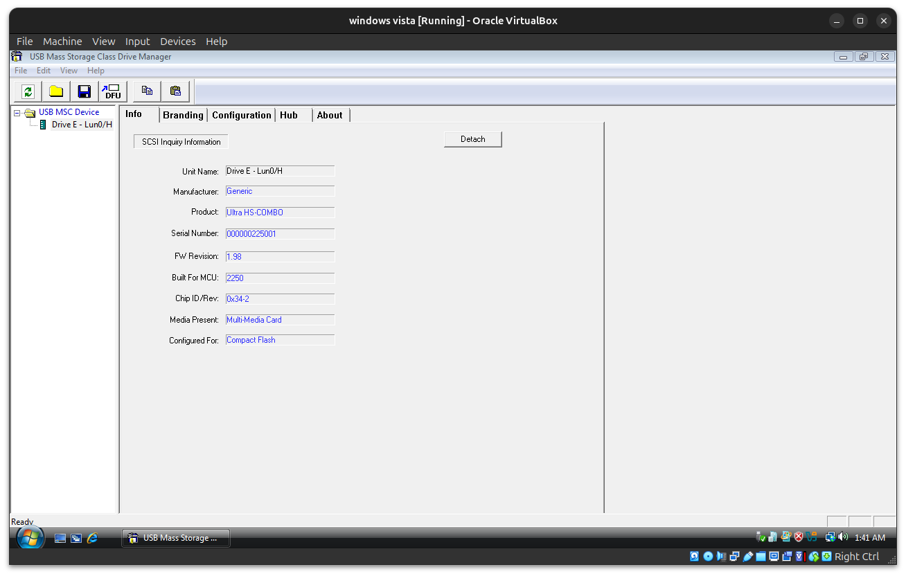

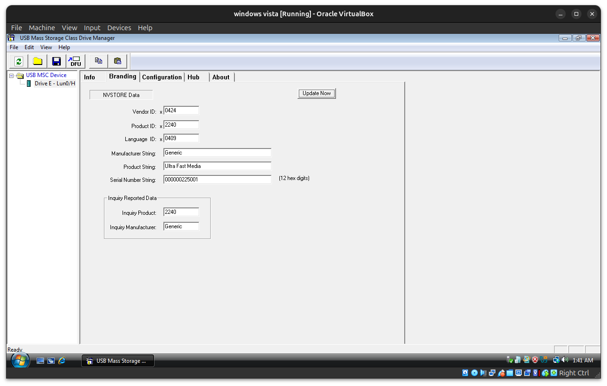

May change manufacturer, product description, VID, PID, etc. upon liking. 

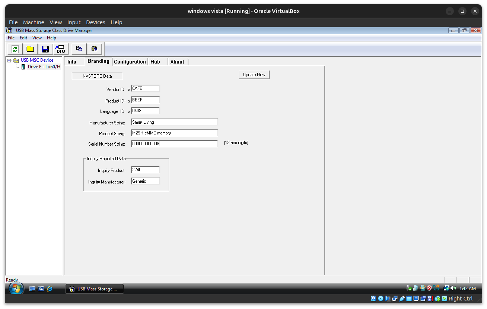

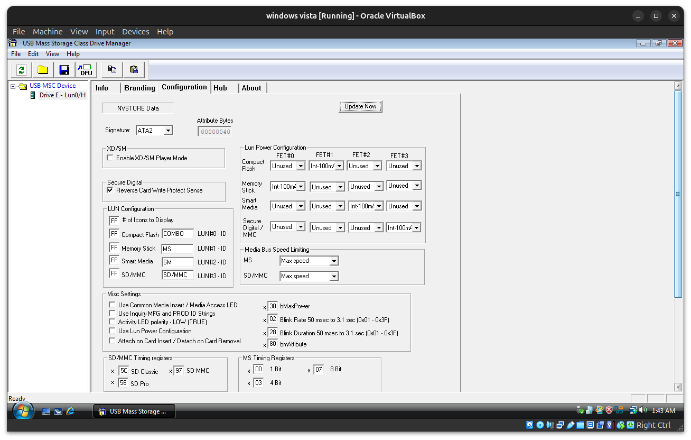

To flash it just click `Update now`

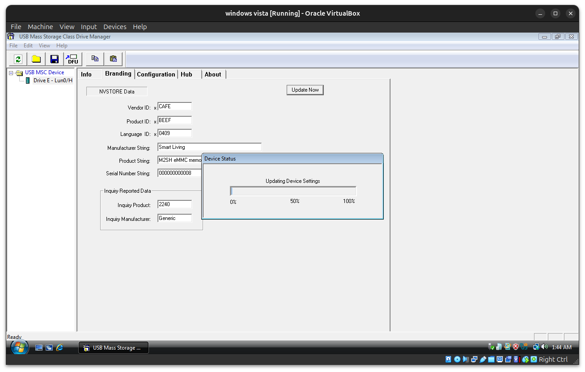

Similarly may modify settings for uSD card reader:
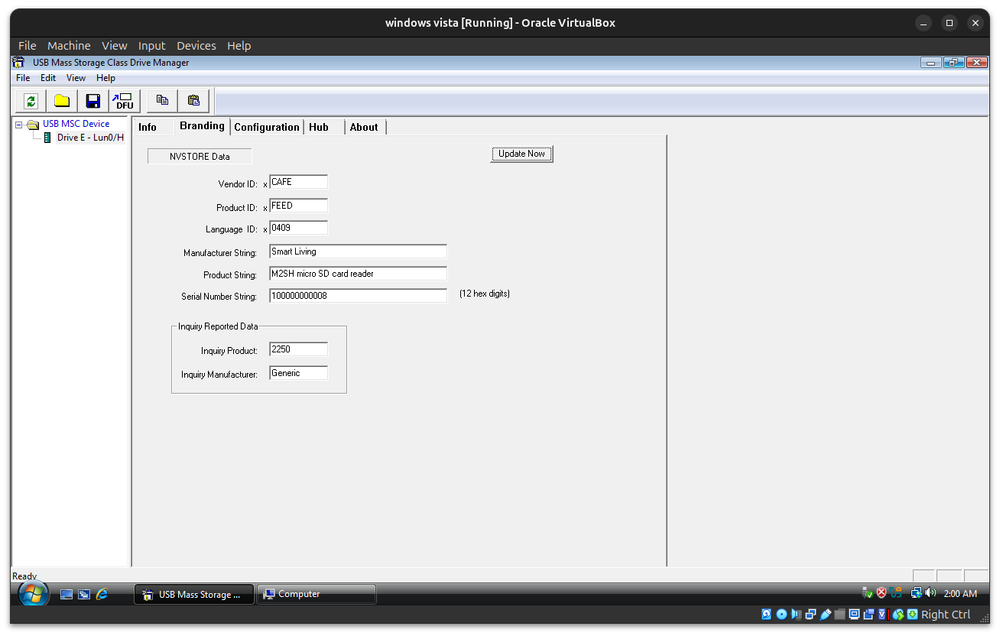

##### Flashing USB2240 using AsProgrammer

Requirements for this method:
- USB CH341A programmer with [3V3 modification](https://www.youtube.com/watch?v=C53-aqp4hbI)
- [AsProgrammer](https://github.com/nofeletru/UsbAsp-flash/releases 
) in this tutorial used [version 2.1.2](https://github.com/nofeletru/UsbAsp-flash/releases/tag/v2.1.2) and Windows environment to run it (native / Wine / Virtual machine)
- TagConnect TC2030 cable - in this tutorial used [DIY version](https://github.com/afedorov3/Tag-Connect-DIY)

To program eMMC controller - conenct TC2030 to J7 and for uSD to J8.


Binary files to be flashed located in `firmware/eMMC_and_uSD/AsProgrammer`:
- `usb2240_eeprom_m2sh_eMMC.bin` 
- `usb2240_eeprom_m2sh_uSD.bin`

In the application select I2C, choose IC->I2C->_24Cxxx->_24C04. Open provided file. To make any modification may do them right in the AsProgrammer window and as a reference use USB2240 datasheet. 
 To start programming click icon `Unprotect -> erase -> program -> verify` 

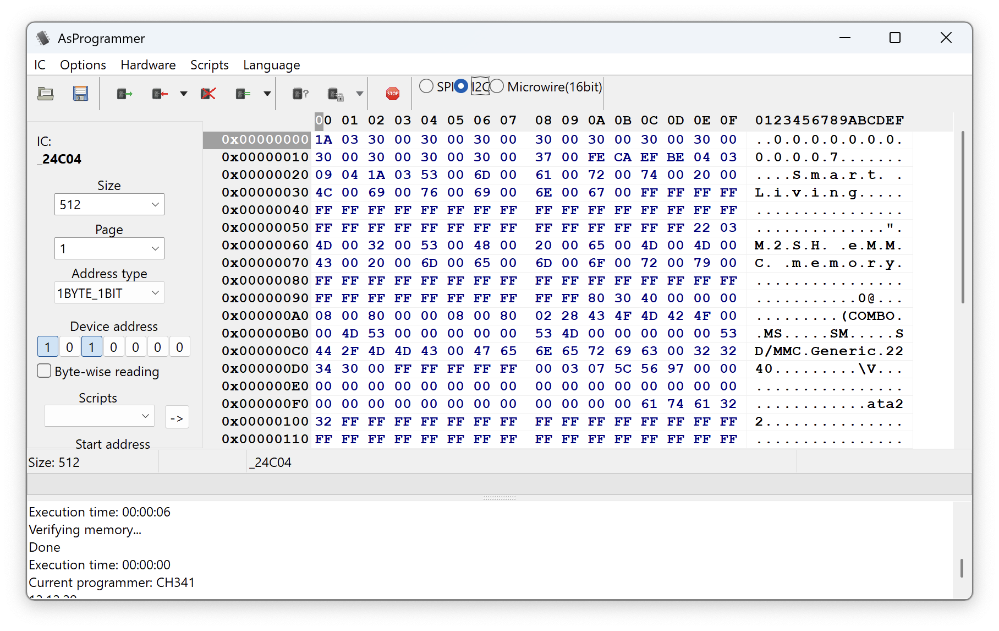

#### Thread radio

Thread radio uses CP2102n USB UART bridge which supports modification of USB parameters as VID, PID, manufacturer and product description. This gives oppurtinity to create own device not easily distinguished in the operating system as USB Serial bridge, rather as custom made piece of hardware. Provided by the manufacturer method of the modification is using [Simplicity Studio](https://www.silabs.com/developer-tools/simplicity-studio) and has been described in [USBXpress™ Device Configuration and Programming Guide](https://www.silabs.com/documents/public/application-notes/AN721.pdf) Due to fact Simplicity Studio is a full fledged IDE, for the customization used simple script `cp210x-cfg` from https://github.com/irrwisch1/cp210x-cfg. Worth to mention is the necessity of additional packages: `sudo apt install build-essential libusb-1.0-0-dev`  
For this device customized only manufacturer string and product description as changing VID and PID would require creation of the custom device driver. 
Checking for proper detection of the device:
```bash
sudo ./cp210x-cfg -l
ID 10c4:ea60 @ bus 003, dev 004: CP2102N USB to UART Bridge Controller
```
Change of the product description:
```bash
sudo ./cp210x-cfg -d 003.004 -N "M2SH Thread radio"
ID 10c4:ea60 @ bus 003, dev 004: CP2102N USB to UART Bridge Controller
Model: CP2102N QFN20
Vendor ID: 10c4
Product ID: ea60
Name: CP2102N USB to UART Bridge Controller
Manufacturer: Silicon Labs
Serial: 9ac4a9c38069ed11b176ea8cedc06881
Use internal serial: 1
ret: 678
IMPORTANT: Device needs to be replugged for some changes to take effect!
```
Change of the manufacturer name:
```bash
./cp210x-cfg -C 'Smart Living'
ID 10c4:ea60 @ bus 003, dev 004: M2SH Thread radio
Model: CP2102N QFN20
Vendor ID: 10c4
Product ID: ea60
Name: M2SH Thread radio
Manufacturer: Smart Living
Serial: 9ac4a9c38069ed11b176ea8cedc06881
Use internal serial: 1
ret: 678
```
After turn off of the PC and back on (CP2102n chip's power is not controlled from the USB HUB and cannot be toggled) those fields should be changed:
```bash
Bus 003 Device 004: ID 10c4:ea60 Silicon Labs CP210x UART Bridge
Device Descriptor:
  [...]
  idVendor           0x10c4 Silicon Labs
  idProduct          0xea60 CP210x UART Bridge
  bcdDevice            1.00
  iManufacturer           1 Smart Living
  iProduct                2 M2SH Thread radio
  iSerial                 3 9ac4a9c38069ed11b176ea8cedc06881
  [...]
```

To flash the firmware [Segger J-Link Base](https://www.segger.com/products/debug-probes/j-link/models/j-link-base/) programmer is necessary (supported by Simiplicity studio). For flashing bootloader used [Simplicity commander](https://www.silabs.com/developer-tools/simplicity-studio/simplicity-commander). Bootloader and firmware used for test are from [NabuCasa github release page](https://github.com/NabuCasa/silabs-firmware-builder/releases/tag/v2025.04.04-1)

To flash bootloader power M2SH from external power supply (3V3 LDO output from segger j-link programmer may be not sufficient), connect TC2030 SWD cable to J9 connector on PCB. In simplicity commander under `Device info` chip should be detected.  


In the `Flash` tab select downloaded bootloader file, then click `Flash`

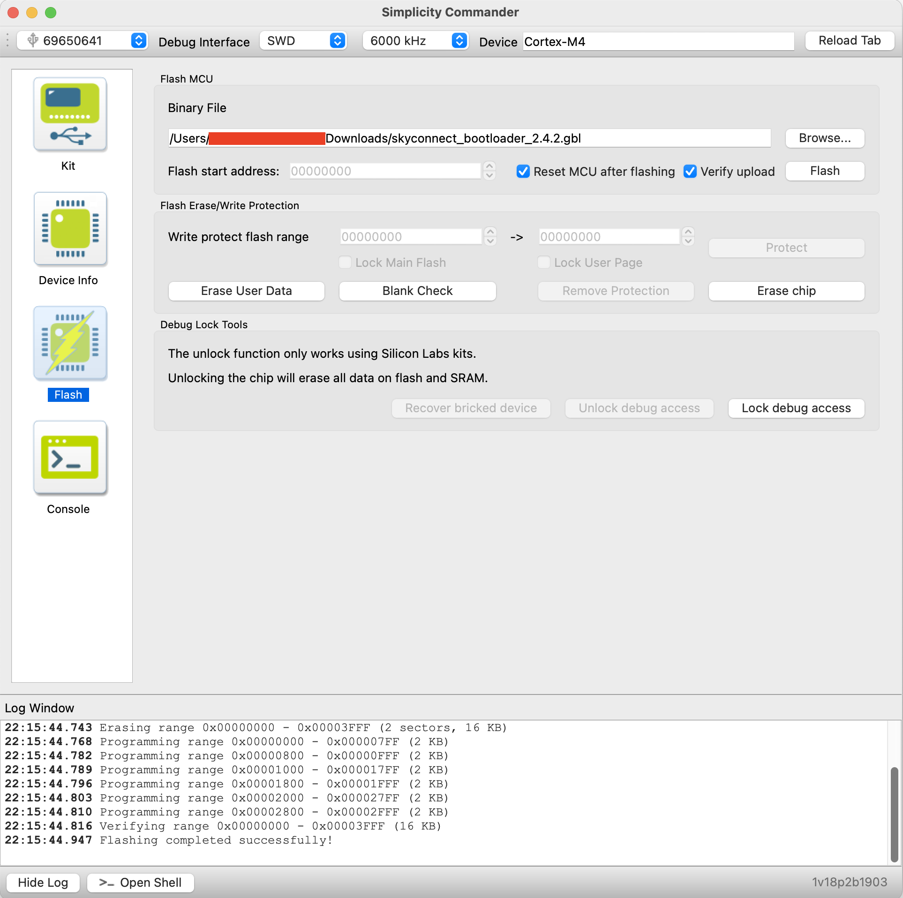

After successfull flash, when connecting to chip's UART (through present on M2SH CP2102n) bootloader should be shown those options:
```bash
Gecko Bootloader v2.04.02
1. upload gbl
2. run
3. ebl info
BL > 
```

To flash firmware may send it via XModem (choose option 1 - `upload gbl` and send the firmware `sx -X skyconnect_zigbee_ncp_7.4.4.1.gbl </dev/ttyUSB0 > /dev/ttyUSB0`) or use Simplicity commander and flash it through SWD - select proper file and just press `Flash`.

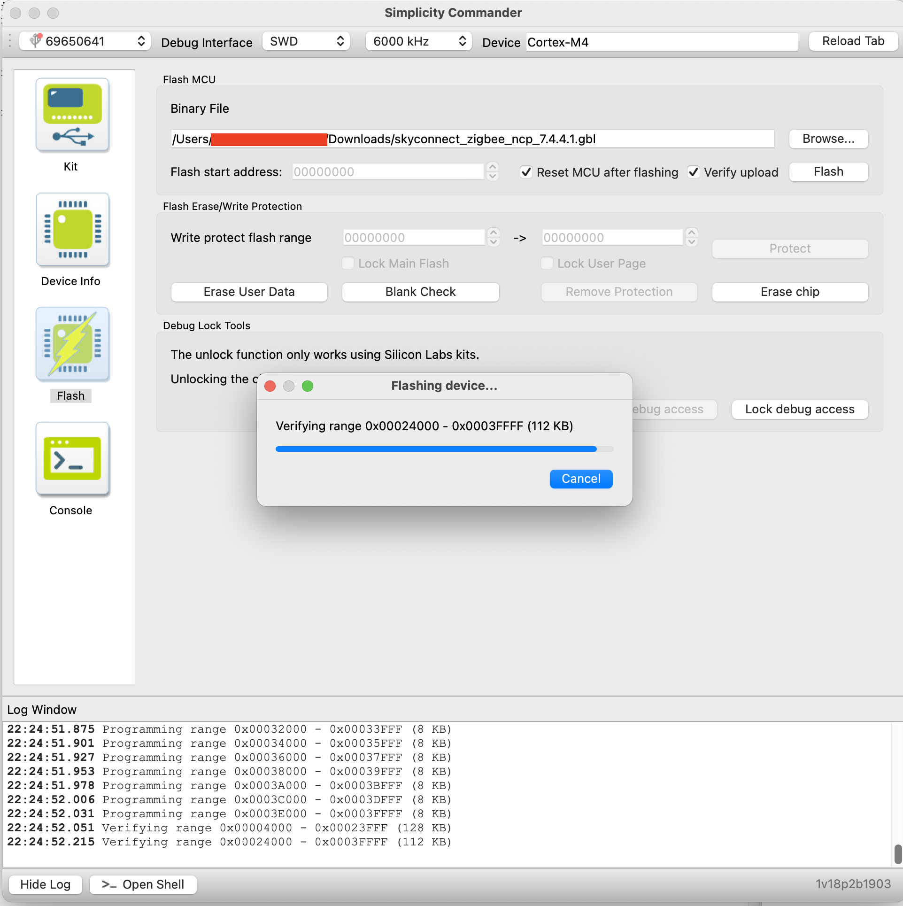


#### WiFi

The brand-new `RTL8188FTV` chip comes unprogrammed, lacking both a MAC address and a serial number. Currently, it's not possible to flash its internal memory using any publicly available tools. The only known method to utilize this network card at the moment involves changing the MAC address directly within the driver, as detailed in the Wi-Fi bring-up section.

Below is a brief summary of the tools explored during the search for a suitable programming solution:

* [**RtPGToolUI**](https://237833645.github.io/doc/work/mtk_work/技术总结报告/RTL8152B调试/res/Realtek%20Linux%20USB%20PG%20Tool%20User%20Guide.pdf): Designed for older wired PCIe Ethernet cards.
* [**Unofficial GitHub Tool**](https://github.com/redchenjs/rtnicpg): Also supports only wired Ethernet cards.
* [**Linux driver for RTL8188**](https://github.com/torvalds/linux/tree/master/drivers/net/wireless/realtek/rtl8xxxu): Developed from scratch, doesn't include any tools for internal memory customization.

No source files were found for the RTL8188 driver, which previously served as the basis for leaked tools used in customizing network cards.


## Repository Structure

This repository contains the following directories:

- `hardware-electronics` - Kicad 8 project (schematic, board and compontent library) 
- `images` - contains photos and reders used in this README
- `firmware` - contains flash binary files for custom devices configurations
