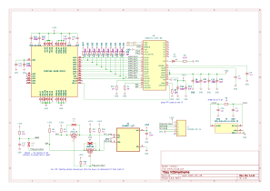

# M2SmartHome

[TODO] update photo


## Overview

Setting up a smart home hub, such as running Home Assistant, often requires hardware with sufficient performance and connectivity options. Many existing solutions, like Raspberry Pi, may be insufficient for advanced automation tasks due to a low-power CPU or a slow microSD card on which the OS is installed. A good alternative could be an x86 mini PC, but these often lack expansion ports.  

M2SmartHome is an add-on card that operates on PCIe 2.0 x1 and can be installed in any M.2 2280 Key M-equipped device. By integrating multiple essential components into a single device, it eliminates the need for external adapters and additional hardware.  

The device is equipped with onboard eMMC memory, an SD card reader, WiFi 802.11n 2.4GHz radio (RTL8188), and a Thread radio (EFR32) from Silicon Labs. Once installed in an M.2 slot, it provides both storage for the operating system and enhanced connectivity, making it an ideal choice for smart home setups.


## Features

- **Form Factor**: M.2 2280 Key M
- **Interface**: M.2 edge conenctor PCIe 2.0 x1 
- **Storage**: Onboard 16GB eMMC, micro SD card reader
- **Wireless Connectivity**:
  - **WiFi**: 802.11n 2.4GHz (Realtek RTL8188)
  - **Thread Radio**: EFR32MG21 (Silicon Labs)


## Block diagram

On the diagram below siplified system architecture has been presented. PCIe 2.0 x1 interface from host device is connected to PCIe bridge. To four USB 2.0 ports all crucial components are connected: eMMC memory controller, micro SD card controller, USB to UART bridge with Thread / ZigBee RF SOC and WiFi network card. 


### PCie to USB bridge
As a PCIe bridge choosen the `TUSB7340` manufactured by Texas Instruments. `TUSB7340` is a PCIe-to-USB 3.0 host controller with a single line  PCIe interface, compliant with the PCIe  Specification 2.0, supporting programmable driver current, de-emphasis levels, and advanced power management (L0, L0s, L1, L2, L2/L3Ready, L3, D0, D3Hot, D3Cold). It features four USB 3.0 ports as well as USB 2.0 data lines with EHCI (480 Mbps) and OHCI (12 Mbps, 1.5 Mbps) controllers for high-, full-, and low-speed transactions. An EEPROM connected via I²C has been added to enable optional features and configurable settings. Additionally TagConnect TC2030 6-pin connector has been added for flashing I²C EEPROM and TC2050 10-pin connector for accesing `TUSB7340` JTAG.


Components related to this part of the schematic has been highlighted in green on the board view:
[TODO] replace render


### eMMC memory with controller

The `USB2244` is connected to a `TUSB7340` PCIe-to-USB bridge, acting as a USB 2.0-to-eMMC controller for Kingston’s `EMMC16G-MW28-01E10`, with a Microchip `24AA04T-I/OT` EEPROM for optional configuration. The eMMC is powered directly from the M.2 3.3V rail, eliminating the need for an LDO. The eMMC interface uses D0–D8, CMD, and CLK lines, with 49.9kΩ pull-ups on CMD and data lines. The EEPROM is connected via I²C (SCL, SDA) with 4.7kΩ pull-ups, storing configuration settings for the USB controller. This setup provides high-speed eMMC access over USB in an M.2 form factor.




### micro SD card reader and controller

The `USB2244` controller interfaces with a Hirose `DM3AT-SF-PEJM5` push-push microSD card slot and with a Microchip `24AA04T-I/OT` EEPROM for configuration storage. The microSD card is powered by the internal 3.3V regulator of the `USB2244`. The SD interface utilizes CLK, CMD, and D0–D3 lines, with 49.9kΩ pull-ups on CMD and data lines for stable operation. The EEPROM is connected via I²C (SCL, SDA) with 4.7kΩ pull-ups, allowing the `USB2244` to load stored device settings at startup. Additionaly TagConnect TC2030 


### Thread radio

The Silicon Labs EFR32MG21B020F1024IM32-B is a 802.15.4 Thread radio SoC, providing wireless connectivity, while the Silicon Labs CP2102N-A02-GQFN20 acts as a USB-to-UART bridge for communication with a host system. The EFR32MG21 is powered from the M.2 3.3V rail, with its radio interface using an external antenna for Thread communication. The CP2102N is connected via USB 2.0 (D+, D-) to the host via PCIe USB bridge. 


### WiFi radio

The Realtek RTL8188FTV-VC-CG is a WiFi 802.11b/g/n 2.4GHz radio SoC, providing wireless connectivity. It is powered from the M.2 3.3V rail and interfaces with the host system via a USB 2.0 connection. The RF section is connected to an external antenna. 


## Manufacturing

PCB has been manufactured by JLCPCB

Add stackup


Add impedance 


## Board bring up 

### Visual inspection and shorts removal

### Powering from lab bench power supply

### Auxilary equipment used for test 


### PCie USB bridge

lspci verbose output
```bash
sudo lspci -vvv | grep -A 80 TUSB                                                                                                                                                                                                                                                                  
01:00.0 USB controller: Texas Instruments TUSB73x0 SuperSpeed USB 3.0 xHCI Host Controller (rev 02) (prog-if 30 [XHCI])
        Control: I/O- Mem+ BusMaster+ SpecCycle- MemWINV- VGASnoop- ParErr- Stepping- SERR+ FastB2B- DisINTx+                                                                                                                                                                                                         
        Status: Cap+ 66MHz- UDF- FastB2B- ParErr- DEVSEL=fast >TAbort- <TAbort- <MAbort- >SERR- <PERR- INTx-
        Latency: 0, Cache Line Size: 64 bytes
        Interrupt: pin A routed to IRQ 16
        Region 0: Memory at ce900000 (64-bit, non-prefetchable) [size=64K]
        Region 2: Memory at ce910000 (64-bit, non-prefetchable) [size=8K]
        Capabilities: [40] Power Management version 3
                Flags: PMEClk- DSI- D1+ D2+ AuxCurrent=0mA PME(D0+,D1+,D2+,D3hot+,D3cold-)
                Status: D0 NoSoftRst+ PME-Enable- DSel=0 DScale=0 PME-
        Capabilities: [48] MSI: Enable- Count=1/8 Maskable- 64bit+
                Address: 0000000000000000  Data: 0000
        Capabilities: [70] Express (v2) Endpoint, MSI 00
                DevCap: MaxPayload 1024 bytes, PhantFunc 0, Latency L0s unlimited, L1 unlimited
                        ExtTag- AttnBtn- AttnInd- PwrInd- RBE+ FLReset- SlotPowerLimit 25W
                DevCtl: CorrErr+ NonFatalErr+ FatalErr+ UnsupReq+
                        RlxdOrd+ ExtTag- PhantFunc- AuxPwr- NoSnoop-
                        MaxPayload 256 bytes, MaxReadReq 512 bytes
                DevSta: CorrErr- NonFatalErr- FatalErr- UnsupReq- AuxPwr- TransPend-
                LnkCap: Port #0, Speed 5GT/s, Width x1, ASPM L0s L1, Exit Latency L0s <512ns, L1 <64us
                        ClockPM+ Surprise- LLActRep- BwNot- ASPMOptComp-
                LnkCtl: ASPM L0s L1 Enabled; RCB 64 bytes, Disabled- CommClk+
                        ExtSynch- ClockPM+ AutWidDis- BWInt- AutBWInt-
                LnkSta: Speed 5GT/s, Width x1
                        TrErr- Train- SlotClk+ DLActive- BWMgmt- ABWMgmt-
                DevCap2: Completion Timeout: Not Supported, TimeoutDis+ NROPrPrP- LTR-
                         10BitTagComp- 10BitTagReq- OBFF Not Supported, ExtFmt- EETLPPrefix-
                         EmergencyPowerReduction Not Supported, EmergencyPowerReductionInit-
                         FRS- TPHComp- ExtTPHComp-
                         AtomicOpsCap: 32bit- 64bit- 128bitCAS-
                DevCtl2: Completion Timeout: 50us to 50ms, TimeoutDis- LTR- 10BitTagReq- OBFF Disabled,
                         AtomicOpsCtl: ReqEn-
                LnkCtl2: Target Link Speed: 5GT/s, EnterCompliance- SpeedDis-
                         Transmit Margin: Normal Operating Range, EnterModifiedCompliance- ComplianceSOS-
                         Compliance Preset/De-emphasis: -6dB de-emphasis, 0dB preshoot
                LnkSta2: Current De-emphasis Level: -6dB, EqualizationComplete- EqualizationPhase1-
                         EqualizationPhase2- EqualizationPhase3- LinkEqualizationRequest-
                         Retimer- 2Retimers- CrosslinkRes: unsupported
        Capabilities: [c0] MSI-X: Enable+ Count=8 Masked-
                Vector table: BAR=2 offset=00000000
                PBA: BAR=2 offset=00001000
        Capabilities: [100 v2] Advanced Error Reporting
                UESta:  DLP- SDES- TLP- FCP- CmpltTO- CmpltAbrt- UnxCmplt- RxOF- MalfTLP- ECRC- UnsupReq- ACSViol-
                UEMsk:  DLP- SDES- TLP- FCP- CmpltTO- CmpltAbrt- UnxCmplt- RxOF- MalfTLP- ECRC- UnsupReq- ACSViol-
                UESvrt: DLP+ SDES+ TLP- FCP+ CmpltTO- CmpltAbrt- UnxCmplt- RxOF+ MalfTLP+ ECRC- UnsupReq- ACSViol-
                CESta:  RxErr- BadTLP- BadDLLP- Rollover- Timeout- AdvNonFatalErr-
                CEMsk:  RxErr- BadTLP- BadDLLP- Rollover- Timeout- AdvNonFatalErr+
                AERCap: First Error Pointer: 00, ECRCGenCap+ ECRCGenEn- ECRCChkCap+ ECRCChkEn-
                        MultHdrRecCap- MultHdrRecEn- TLPPfxPres- HdrLogCap-
                HeaderLog: 00000000 00000000 00000000 00000000
        Capabilities: [150 v1] Device Serial Number 08-00-28-00-00-20-00-00
        Kernel driver in use: xhci_hcd
        Kernel modules: xhci_pci
```


```bash
01:00.0 USB controller [0c03]: Texas Instruments TUSB73x0 SuperSpeed USB 3.0 xHCI Host Controller [104c:8241] (rev 02) (prog-if 30 [XHCI])
	Control: I/O- Mem+ BusMaster+ SpecCycle- MemWINV- VGASnoop- ParErr- Stepping- SERR+ FastB2B- DisINTx+
	Status: Cap+ 66MHz- UDF- FastB2B- ParErr- DEVSEL=fast >TAbort- <TAbort- <MAbort- >SERR- <PERR- INTx-
	Latency: 0, Cache Line Size: 64 bytes
	Interrupt: pin A routed to IRQ 16
	Region 0: Memory at ce900000 (64-bit, non-prefetchable) [size=64K]
	Region 2: Memory at ce910000 (64-bit, non-prefetchable) [size=8K]
	Capabilities: [40] Power Management version 3
		Flags: PMEClk- DSI- D1+ D2+ AuxCurrent=0mA PME(D0+,D1+,D2+,D3hot+,D3cold-)
		Status: D0 NoSoftRst+ PME-Enable- DSel=0 DScale=0 PME-
	Capabilities: [48] MSI: Enable- Count=1/8 Maskable- 64bit+
		Address: 0000000000000000  Data: 0000
	Capabilities: [70] Express (v2) Endpoint, MSI 00
		DevCap:	MaxPayload 1024 bytes, PhantFunc 0, Latency L0s unlimited, L1 unlimited
			ExtTag- AttnBtn- AttnInd- PwrInd- RBE+ FLReset- SlotPowerLimit 25W
		DevCtl:	CorrErr+ NonFatalErr+ FatalErr+ UnsupReq+
			RlxdOrd+ ExtTag- PhantFunc- AuxPwr- NoSnoop-
			MaxPayload 256 bytes, MaxReadReq 512 bytes
		DevSta:	CorrErr- NonFatalErr- FatalErr- UnsupReq- AuxPwr- TransPend-
		LnkCap:	Port #0, Speed 5GT/s, Width x1, ASPM L0s L1, Exit Latency L0s <512ns, L1 <64us
			ClockPM+ Surprise- LLActRep- BwNot- ASPMOptComp-
		LnkCtl:	ASPM L0s L1 Enabled; RCB 64 bytes, Disabled- CommClk+
			ExtSynch- ClockPM+ AutWidDis- BWInt- AutBWInt-
		LnkSta:	Speed 5GT/s, Width x1
			TrErr- Train- SlotClk+ DLActive- BWMgmt- ABWMgmt-
		DevCap2: Completion Timeout: Not Supported, TimeoutDis+ NROPrPrP- LTR-
			 10BitTagComp- 10BitTagReq- OBFF Not Supported, ExtFmt- EETLPPrefix-
			 EmergencyPowerReduction Not Supported, EmergencyPowerReductionInit-
			 FRS- TPHComp- ExtTPHComp-
			 AtomicOpsCap: 32bit- 64bit- 128bitCAS-
		DevCtl2: Completion Timeout: 50us to 50ms, TimeoutDis- LTR- 10BitTagReq- OBFF Disabled,
			 AtomicOpsCtl: ReqEn-
		LnkCtl2: Target Link Speed: 5GT/s, EnterCompliance- SpeedDis-
			 Transmit Margin: Normal Operating Range, EnterModifiedCompliance- ComplianceSOS-
			 Compliance Preset/De-emphasis: -6dB de-emphasis, 0dB preshoot
		LnkSta2: Current De-emphasis Level: -6dB, EqualizationComplete- EqualizationPhase1-
			 EqualizationPhase2- EqualizationPhase3- LinkEqualizationRequest-
			 Retimer- 2Retimers- CrosslinkRes: unsupported
	Capabilities: [c0] MSI-X: Enable+ Count=8 Masked-
		Vector table: BAR=2 offset=00000000
		PBA: BAR=2 offset=00001000
	Capabilities: [100 v2] Advanced Error Reporting
		UESta:	DLP- SDES- TLP- FCP- CmpltTO- CmpltAbrt- UnxCmplt- RxOF- MalfTLP- ECRC- UnsupReq- ACSViol-
		UEMsk:	DLP- SDES- TLP- FCP- CmpltTO- CmpltAbrt- UnxCmplt- RxOF- MalfTLP- ECRC- UnsupReq- ACSViol-
		UESvrt:	DLP+ SDES+ TLP- FCP+ CmpltTO- CmpltAbrt- UnxCmplt- RxOF+ MalfTLP+ ECRC- UnsupReq- ACSViol-
		CESta:	RxErr- BadTLP- BadDLLP- Rollover- Timeout- AdvNonFatalErr-
		CEMsk:	RxErr- BadTLP- BadDLLP- Rollover- Timeout- AdvNonFatalErr+
		AERCap:	First Error Pointer: 00, ECRCGenCap+ ECRCGenEn- ECRCChkCap+ ECRCChkEn-
			MultHdrRecCap- MultHdrRecEn- TLPPfxPres- HdrLogCap-
		HeaderLog: 00000000 00000000 00000000 00000000
	Capabilities: [150 v1] Device Serial Number 08-00-28-00-00-20-00-00
	Kernel driver in use: xhci_hcd
	Kernel modules: xhci_pci
```


Default PCIe config in hex form:
```bash
user@user-HP-Elitedesk-800-G3-Mini:~$ sudo lspci -s 01:00 -xxx
01:00.0 USB controller: Texas Instruments TUSB73x0 SuperSpeed USB 3.0 xHCI Host Controller (rev 02)
00: 4c 10 41 82 06 05 10 00 02 30 03 0c 10 00 00 00
10: 04 00 90 ce 00 00 00 00 04 00 91 ce 00 00 00 00
20: 00 00 00 00 00 00 00 00 00 00 00 00 00 00 00 00
30: 00 00 00 00 40 00 00 00 00 00 00 00 ff 01 00 00
40: 01 48 03 7e 08 00 00 00 05 70 86 00 00 00 00 00
50: 00 00 00 00 00 00 00 00 00 00 00 00 00 00 00 00
60: 30 20 00 00 00 00 00 00 00 00 00 00 00 00 00 00
70: 10 c0 02 00 c3 8f e8 07 3f 20 00 00 12 3c 07 00
80: 43 01 12 10 00 00 00 00 00 00 00 00 00 00 00 00
90: 00 00 00 00 10 00 00 00 00 00 00 00 00 00 00 00
a0: 02 00 00 00 00 00 00 00 00 00 00 00 00 00 00 00
b0: 00 00 00 00 00 00 0f 00 00 00 00 00 00 00 00 00
c0: 11 00 07 80 02 00 00 00 02 10 00 00 00 00 00 00
d0: 00 00 00 00 ab 0d 00 00 1b 00 00 00 3f 00 00 00
e0: 00 00 00 00 00 00 00 00 00 00 00 00 00 00 00 00
f0: 00 00 00 00 00 00 00 00 00 00 00 00 00 00 00 00
```


```bash
/:  Bus 003.Port 001: Dev 001, Class=root_hub, Driver=xhci_hcd/4p, 480M
    ID 1d6b:0002 Linux Foundation 2.0 root hub
    |__ Port 001: Dev 002, If 0, Class=Vendor Specific Class, Driver=rtl8xxxu, 480M
        ID 0bda:f179 Realtek Semiconductor Corp. RTL8188FTV 802.11b/g/n 1T1R 2.4G WLAN Adapter
    |__ Port 002: Dev 003, If 0, Class=Mass Storage, Driver=usb-storage, 480M
        ID 0424:2240 Microchip Technology, Inc. (formerly SMSC) 
    |__ Port 003: Dev 004, If 0, Class=Vendor Specific Class, Driver=cp210x, 12M
        ID 10c4:ea60 Silicon Labs CP210x UART Bridge
    |__ Port 004: Dev 005, If 0, Class=Mass Storage, Driver=usb-storage, 480M
        ID 0424:2240 Microchip Technology, Inc. (formerly SMSC) 
```


### eMMC memory

This part has been tested by the removal of the series resistors on USB data lines and conencting this directly to USB port through cable, while beeing powered from M.2 port. eMMC memory is properly detected in the operating system, it is readable and writtable. Works without any issues during benchmarking and extended write test. Tested on HP 800 G3 SFF on Ubuntu 22.04.


`lsusb -d 0424:2240 -vvv`:
```bash
Bus 001 Device 008: ID 0424:2240 Microchip Technology, Inc. (formerly SMSC) Ultra Fast Media
Couldn't open device, some information will be missing
Device Descriptor:
bLength 18
bDescriptorType 1
bcdUSB 2.00
bDeviceClass 0 [unknown]
bDeviceSubClass 0 [unknown]
bDeviceProtocol 0
bMaxPacketSize0 64
idVendor 0x0424 Microchip Technology, Inc. (formerly SMSC)
idProduct 0x2240 Ultra Fast Media
bcdDevice 1.98
iManufacturer 1 Generic
iProduct 2 Ultra Fast Media
iSerial 3 000000225001
bNumConfigurations 1
Configuration Descriptor:
bLength 9
bDescriptorType 2
wTotalLength 0x0020
bNumInterfaces 1
bConfigurationValue 1
iConfiguration 0
bmAttributes 0x80
(Bus Powered)
MaxPower 96mA
Interface Descriptor:
bLength 9
bDescriptorType 4
bInterfaceNumber 0
bAlternateSetting 0
bNumEndpoints 2
bInterfaceClass 8 Mass Storage
bInterfaceSubClass 6 SCSI
bInterfaceProtocol 80 Bulk-Only
iInterface 0
Endpoint Descriptor:
bLength 7
bDescriptorType 5
bEndpointAddress 0x02 EP 2 OUT
bmAttributes 2
Transfer Type Bulk
Synch Type None
Usage Type Data
wMaxPacketSize 0x0200 1x 512 bytes
bInterval 1
Endpoint Descriptor:
bLength 7
bDescriptorType 5
bEndpointAddress 0x82 EP 2 IN
bmAttributes 2
Transfer Type Bulk
Synch Type None
Usage Type Data
wMaxPacketSize 0x0200 1x 512 bytes
bInterval 0

```

`lsblk`:
```bash
NAME MAJ:MIN RM SIZE RO TYPE MOUNTPOINTS
sdb 8:16 1 14.6G 0 disk
```

`dmesg`:
```bash
[ 2402.769465] usb 1-13: new high-speed USB device number 8 using xhci_hcd
[ 2402.902304] usb 1-13: New USB device found, idVendor=0424, idProduct=2240, bcdDevice= 1.98
[ 2402.902327] usb 1-13: New USB device strings: Mfr=1, Product=2, SerialNumber=3
[ 2402.902335] usb 1-13: Product: Ultra Fast Media
[ 2402.902341] usb 1-13: Manufacturer: Generic
[ 2402.902347] usb 1-13: SerialNumber: 000000225001
[ 2402.907570] usb-storage 1-13:1.0: USB Mass Storage device detected
[ 2402.907866] scsi host2: usb-storage 1-13:1.0
[ 2403.963071] scsi 2:0:0:0: Direct-Access Generic Ultra HS-COMBO 1.98 PQ: 0 ANSI: 0
[ 2403.963267] sd 2:0:0:0: Attached scsi generic sg1 type 0
[ 2403.969432] sd 2:0:0:0: [sdb] 30615552 512-byte logical blocks: (15.7 GB/14.6 GiB)
[ 2403.970000] sd 2:0:0:0: [sdb] Write Protect is off
[ 2403.970004] sd 2:0:0:0: [sdb] Mode Sense: 23 00 00 00
[ 2403.970608] sd 2:0:0:0: [sdb] No Caching mode page found
[ 2403.970611] sd 2:0:0:0: [sdb] Assuming drive cache: write through
[ 2403.974170] sd 2:0:0:0: [sdb] Attached SCSI removable disk
```

Benchmarked using Gnome Disks tool:


Extended write/read test which took aproximately 6 hours:
```bash 
sudo badblocks -wsv /dev/sdc
Checking for bad blocks in read-write mode
From block 0 to 15307775
Testing with pattern 0xaa: done                                                 
Reading and comparing: done                                                 
Testing with pattern 0x55: done                                                 
Reading and comparing: done                                                 
Testing with pattern 0xff: done                                                 
Reading and comparing: done                                                 
Testing with pattern 0x00: done                                                 
Reading and comparing: done                                                 
Pass completed, 0 bad blocks found. (0/0/0 errors)
```

### uSD reader

This part has been tested by the removal of the series resistors on USB data lines and conencting this directly to USB port through cable, while beeing powered from M.2 port. Various micro SD cards are properly detected in the operating system, they are readable and writtable. Works without any issues during benchmarking and extended write test. Tested on HP 800 G3 SFF on Ubuntu 22.04.

`lsusb -d 0424:2240 -vvv`:
```bash
Bus 001 Device 005: ID 0424:2240 Microchip Technology, Inc. (formerly SMSC) Ultra Fast Media
Couldn't open device, some information will be missing
Device Descriptor:
bLength 18
bDescriptorType 1
bcdUSB 2.00
bDeviceClass 0 [unknown]
bDeviceSubClass 0 [unknown]
bDeviceProtocol 0
bMaxPacketSize0 64
idVendor 0x0424 Microchip Technology, Inc. (formerly SMSC)
idProduct 0x2240 Ultra Fast Media
bcdDevice 1.98
iManufacturer 1 Generic
iProduct 2 Ultra Fast Media
iSerial 3 000000225001
bNumConfigurations 1
Configuration Descriptor:
bLength 9
bDescriptorType 2
wTotalLength 0x0020
bNumInterfaces 1
bConfigurationValue 1
iConfiguration 0
bmAttributes 0x80
(Bus Powered)
MaxPower 96mA
Interface Descriptor:
bLength 9
bDescriptorType 4
bInterfaceNumber 0
bAlternateSetting 0
bNumEndpoints 2
bInterfaceClass 8 Mass Storage
bInterfaceSubClass 6 SCSI
bInterfaceProtocol 80 Bulk-Only
iInterface 0
Endpoint Descriptor:
bLength 7
bDescriptorType 5
bEndpointAddress 0x02 EP 2 OUT
bmAttributes 2
Transfer Type Bulk
Synch Type None
Usage Type Data
wMaxPacketSize 0x0200 1x 512 bytes
bInterval 1
Endpoint Descriptor:
bLength 7
bDescriptorType 5
bEndpointAddress 0x82 EP 2 IN
bmAttributes 2
Transfer Type Bulk
Synch Type None
Usage Type Data
wMaxPacketSize 0x0200 1x 512 bytes
bInterval 0
```

`lsblk`:
```bash
NAME MAJ:MIN RM SIZE RO TYPE MOUNTPOINTS
sdb 8:16 1 3.7G 0 disk
└─sdb1 8:17 1 3.7G 0 part /media/user/9016-4EF8
```

`dmesg` with connected just empty reader:
```bash
[ 33.892694] usb 1-13: new high-speed USB device number 5 using xhci_hcd
[ 34.027971] usb 1-13: New USB device found, idVendor=0424, idProduct=2240, bcdDevice= 1.98
[ 34.027977] usb 1-13: New USB device strings: Mfr=1, Product=2, SerialNumber=3
[ 34.027979] usb 1-13: Product: Ultra Fast Media
[ 34.027981] usb 1-13: Manufacturer: Generic
[ 34.027983] usb 1-13: SerialNumber: 000000225001
[ 34.051629] usb-storage 1-13:1.0: USB Mass Storage device detected
[ 34.051918] scsi host2: usb-storage 1-13:1.0
[ 34.052013] usbcore: registered new interface driver usb-storage
[ 34.054051] usbcore: registered new interface driver uas
[ 35.074189] scsi 2:0:0:0: Direct-Access Generic Ultra HS-COMBO 1.98 PQ: 0 ANSI: 0
[ 35.074516] sd 2:0:0:0: Attached scsi generic sg1 type 0
[ 35.075325] sd 2:0:0:0: [sdb] Media removed, stopped polling
[ 35.075721] sd 2:0:0:0: [sdb] Attached SCSI removable disk
```


`dmesg` when inserted 4GB micro SD card:
```bash
[ 651.529877] sd 2:0:0:0: [sdb] 7759872 512-byte logical blocks: (3.97 GB/3.70 GiB)
[ 651.531210] sdb: detected capacity change from 0 to 7759872
[ 651.532979] sdb: sdb1
```

Benchmarked using Gnome Disks tool. Tested 3 different uSD cards. 
1. Off brand 4GB class 4 micro SD card 


2. ATP 1GB SLC industrial micro SD card:


3. San Disk Extreme 32GB class Ultra 3:


Extended write/write test which took aproximately 6 hours, using badblock tool:
```bash
sudo badblocks -wsv /dev/sdX
Checking for bad blocks in read-write mode
From block 0 to 31154687
Testing with pattern 0xaa: done                                                 
Reading and comparing: done                                                 
Testing with pattern 0x55: done                                                 
Reading and comparing: done                                                 
Testing with pattern 0xff: done                                                 
Reading and comparing: done                                                 
Testing with pattern 0x00: done                                                 
Reading and comparing: done                                                 
Pass completed, 0 bad blocks found. (0/0/0 errors)
```

### Thread radio

To be described.

```bash
Bus 003 Device 004: ID 10c4:ea60 Silicon Labs CP210x UART Bridge
Device Descriptor:
  bLength                18
  bDescriptorType         1
  bcdUSB               2.00
  bDeviceClass            0 [unknown]
  bDeviceSubClass         0 [unknown]
  bDeviceProtocol         0 
  bMaxPacketSize0        64
  idVendor           0x10c4 Silicon Labs
  idProduct          0xea60 CP210x UART Bridge
  bcdDevice            1.00
  iManufacturer           1 Silicon Labs
  iProduct                2 CP2102N USB to UART Bridge Controller
  iSerial                 3 9ac4a9c38069ed11b176ea8cedc06881
  bNumConfigurations      1
  Configuration Descriptor:
    bLength                 9
    bDescriptorType         2
    wTotalLength       0x0020
    bNumInterfaces          1
    bConfigurationValue     1
    iConfiguration          0 
    bmAttributes         0x80
      (Bus Powered)
    MaxPower              100mA
    Interface Descriptor:
      bLength                 9
      bDescriptorType         4
      bInterfaceNumber        0
      bAlternateSetting       0
      bNumEndpoints           2
      bInterfaceClass       255 Vendor Specific Class
      bInterfaceSubClass      0 [unknown]
      bInterfaceProtocol      0 
      iInterface              0 
      Endpoint Descriptor:
        bLength                 7
        bDescriptorType         5
        bEndpointAddress     0x02  EP 2 OUT
        bmAttributes            2
can't get device qualifier: Resource temporarily unavailable
can't get debug descriptor: Resource temporarily unavailable
can't get debug descriptor: Resource temporarily unavailable
          Transfer Type            Bulk
          Synch Type               None
          Usage Type               Data
        wMaxPacketSize     0x0040  1x 64 bytes
        bInterval               0
      Endpoint Descriptor:
        bLength                 7
        bDescriptorType         5
        bEndpointAddress     0x82  EP 2 IN
        bmAttributes            2
          Transfer Type            Bulk
          Synch Type               None
          Usage Type               Data
        wMaxPacketSize     0x0040  1x 64 bytes
        bInterval               0
Device Status:     0x0000
  (Bus Powered)
```


### WiFi radio

To be described.


```bash
lsusb -d 0bda:f179 -vvv

Bus 001 Device 054: ID 0bda:f179 Realtek Semiconductor Corp. RTL8188FTV 802.11b/g/n 1T1R 2.4G WLAN Adapter
Couldn't open device, some information will be missing
Device Descriptor:
  bLength                18
  bDescriptorType         1
  bcdUSB               2.00
  bDeviceClass            0 [unknown]
  bDeviceSubClass         0 [unknown]
  bDeviceProtocol         0 
  bMaxPacketSize0        64
  idVendor           0x0bda Realtek Semiconductor Corp.
  idProduct          0xf179 RTL8188FTV 802.11b/g/n 1T1R 2.4G WLAN Adapter
  bcdDevice            0.00
  iManufacturer           1 Realtek
  iProduct                2 802.11n NIC
  iSerial                 3 00E04CB82100
  bNumConfigurations      1
  Configuration Descriptor:
    bLength                 9
    bDescriptorType         2
    wTotalLength       0x0035
    bNumInterfaces          1
    bConfigurationValue     1
    iConfiguration          0 
    bmAttributes         0x80
      (Bus Powered)
    MaxPower              500mA
    Interface Descriptor:
      bLength                 9
      bDescriptorType         4
      bInterfaceNumber        0
      bAlternateSetting       0
      bNumEndpoints           5
      bInterfaceClass       255 Vendor Specific Class
      bInterfaceSubClass    255 Vendor Specific Subclass
      bInterfaceProtocol    255 Vendor Specific Protocol
      iInterface              0 
      Endpoint Descriptor:
        bLength                 7
        bDescriptorType         5
        bEndpointAddress     0x81  EP 1 IN
        bmAttributes            2
          Transfer Type            Bulk
          Synch Type               None
          Usage Type               Data
        wMaxPacketSize     0x0200  1x 512 bytes
        bInterval               0
      Endpoint Descriptor:
        bLength                 7
        bDescriptorType         5
        bEndpointAddress     0x02  EP 2 OUT
        bmAttributes            2
          Transfer Type            Bulk
          Synch Type               None
          Usage Type               Data
        wMaxPacketSize     0x0200  1x 512 bytes
        bInterval               0
      Endpoint Descriptor:
        bLength                 7
        bDescriptorType         5
        bEndpointAddress     0x03  EP 3 OUT
        bmAttributes            2
          Transfer Type            Bulk
          Synch Type               None
          Usage Type               Data
        wMaxPacketSize     0x0200  1x 512 bytes
        bInterval               0
      Endpoint Descriptor:
        bLength                 7
        bDescriptorType         5
        bEndpointAddress     0x04  EP 4 OUT
        bmAttributes            2
          Transfer Type            Bulk
          Synch Type               None
          Usage Type               Data
        wMaxPacketSize     0x0200  1x 512 bytes
        bInterval               0
      Endpoint Descriptor:
        bLength                 7
        bDescriptorType         5
        bEndpointAddress     0x85  EP 5 IN
        bmAttributes            3
          Transfer Type            Interrupt
          Synch Type               None
          Usage Type               Data
        wMaxPacketSize     0x0040  1x 64 bytes
        bInterval               1
```

dmesg:
```bash
[ 4347.746012] usb 1-13: new high-speed USB device number 54 using xhci_hcd
[ 4347.872442] usb 1-13: New USB device found, idVendor=0bda, idProduct=f179, bcdDevice= 0.00
[ 4347.872462] usb 1-13: New USB device strings: Mfr=1, Product=2, SerialNumber=3
[ 4347.872470] usb 1-13: Product: 802.11n NIC
[ 4347.872476] usb 1-13: Manufacturer: Realtek
[ 4347.872482] usb 1-13: SerialNumber: 00E04CB82100
[ 4347.997955] cfg80211: Loading compiled-in X.509 certificates for regulatory database
[ 4347.998132] Loaded X.509 cert 'sforshee: 00b28ddf47aef9cea7'
[ 4347.998277] Loaded X.509 cert 'wens: 61c038651aabdcf94bd0ac7ff06c7248db18c600'
[ 4348.092372] usb 1-13: RTL8188FU rev B (SMIC) romver 0, 1T1R, TX queues 3, WiFi=1, BT=0, GPS=0, HI PA=0
[ 4348.092378] usb 1-13: RTL8188FU MAC: ff:ff:ff:ff:ff:ff
[ 4348.092380] usb 1-13: rtl8xxxu: Loading firmware rtlwifi/rtl8188fufw.bin
[ 4348.093970] usb 1-13: Firmware revision 4.0 (signature 0x88f1)
[ 4349.117854] usbcore: registered new interface driver rtl8xxxu
[ 4349.130891] rtl8xxxu 1-13:1.0 wlxffffffffffff: renamed from wlan0
```

assigning custom MAC address (temporarly)
```bash
sudo ip link set wlxffffffffffff down
sudo ip link set wlxffffffffffff address 12:34:56:78:9A:BC
ip a
sudo ip link set wlxffffffffffff up
ip link show wlxffffffffffff 
sudo iw dev wlxffffffffffff scan
```

scanning for wifi networks after modification:
```bash
sudo iw dev wlxffffffffffff scan
BSS c8:bc:c8:fd:91:27(on wlxffffffffffff)
	TSF: 3469783757152 usec (40d, 03:49:43)
	freq: 2412.0
	beacon interval: 100 TUs
	capability: ESS Privacy ShortPreamble ShortSlotTime RadioMeasure (0x1431)
	signal: -76.00 dBm
	last seen: 954 ms ago
	SSID: Gruszka
	Supported rates: 1.0* 2.0* 5.5* 11.0* 6.0 9.0 12.0 18.0 
	DS Parameter set: channel 1
	TIM: DTIM Count 0 DTIM Period 3 Bitmap Control 0x0 Bitmap[0] 0x0
	Country: JP	Environment: Indoor/Outdoor
		Channels [1 - 13] @ 30 dBm
	ERP: Use_Protection
	Extended supported rates: 24.0 36.0 48.0 54.0 
	RSN:	 * Version: 1
		 * Group cipher: CCMP
		 * Pairwise ciphers: CCMP
		 * Authentication suites: PSK
		 * Capabilities: 1-PTKSA-RC 1-GTKSA-RC (0x0000)
	HT capabilities:
		Capabilities: 0x41ac
			HT20
			SM Power Save disabled
			RX HT20 SGI
			TX STBC
			RX STBC 1-stream
			Max AMSDU length: 3839 bytes
			No DSSS/CCK HT40
			40 MHz Intolerant
		Maximum RX AMPDU length 65535 bytes (exponent: 0x003)
		Minimum RX AMPDU time spacing: 4 usec (0x05)
		HT RX MCS rate indexes supported: 0-23
		HT TX MCS rate indexes are undefined
	AP Channel Report:
		 * operating class: 116
		 * channel(s): 36
	AP Channel Report:
		 * operating class: 128
		 * channel(s): 36
	AP Channel Report:
		 * operating class: 81
		 * channel(s): 11
	HT operation:
		 * primary channel: 1
		 * secondary channel offset: no secondary
		 * STA channel width: 20 MHz
		 * RIFS: 0
		 * HT protection: nonmember
		 * non-GF present: 0
		 * OBSS non-GF present: 1
		 * dual beacon: 0
		 * dual CTS protection: 0
		 * STBC beacon: 0
		 * L-SIG TXOP Prot: 0
		 * PCO active: 0
		 * PCO phase: 0
	RM enabled capabilities:
		Capabilities: 0x02 0x00 0x01 0x00 0x00
			Neighbor Report
			AP Channel Report
		Nonoperating Channel Max Measurement Duration: 0
		Measurement Pilot Capability: 0
	WMM:	 * Parameter version 1
		 * BE: CW 15-1023, AIFSN 3
		 * BK: CW 15-1023, AIFSN 7
		 * VI: CW 7-15, AIFSN 2, TXOP 3008 usec
		 * VO: CW 3-7, AIFSN 2, TXOP 1504 usec
BSS 00:eb:d8:12:60:03(on wlxffffffffffff)
	TSF: 7773816861829 usec (89d, 23:23:36)
	freq: 2427.0
	beacon interval: 100 TUs
	capability: ESS Privacy ShortSlotTime APSD (0x0c11)
	signal: -68.00 dBm
	last seen: 0 ms ago
	Information elements from Probe Response frame:
	SSID: Dabrowskiego_89_180_B
	Supported rates: 1.0* 2.0* 5.5* 11.0* 9.0 18.0 36.0 54.0 
	DS Parameter set: channel 4
	ERP: Barker_Preamble_Mode
	Extended supported rates: 6.0 12.0 24.0 48.0 
	WPA:	 * Version: 1
		 * Group cipher: CCMP
		 * Pairwise ciphers: CCMP
		 * Authentication suites: PSK
	RSN:	 * Version: 1
		 * Group cipher: CCMP
		 * Pairwise ciphers: CCMP
		 * Authentication suites: PSK
		 * Capabilities: 1-PTKSA-RC 1-GTKSA-RC (0x0000)
	HT capabilities:
		Capabilities: 0x11ef
			RX LDPC
			HT20/HT40
			SM Power Save disabled
			RX HT20 SGI
			RX HT40 SGI
			TX STBC
			RX STBC 1-stream
			Max AMSDU length: 3839 bytes
			DSSS/CCK HT40
		Maximum RX AMPDU length 65535 bytes (exponent: 0x003)
		Minimum RX AMPDU time spacing: 4 usec (0x05)
		HT RX MCS rate indexes supported: 0-15
		HT TX MCS rate indexes are undefined
	HT operation:
		 * primary channel: 4
		 * secondary channel offset: no secondary
		 * STA channel width: 20 MHz
		 * RIFS: 0
		 * HT protection: 20 MHz
		 * non-GF present: 1
		 * OBSS non-GF present: 0
		 * dual beacon: 0
		 * dual CTS protection: 0
		 * STBC beacon: 0
		 * L-SIG TXOP Prot: 0
		 * PCO active: 0
		 * PCO phase: 0
	Overlapping BSS scan params:
		 * passive dwell: 20 TUs
		 * active dwell: 10 TUs
		 * channel width trigger scan interval: 300 s
		 * scan passive total per channel: 200 TUs
		 * scan active total per channel: 20 TUs
		 * BSS width channel transition delay factor: 5
		 * OBSS Scan Activity Threshold: 0.25 %
	BSS Load:
		 * station count: 2
		 * channel utilisation: 0/255
		 * available admission capacity: 31250 [*32us]
	WMM:	 * Parameter version 1
		 * u-APSD
		 * BE: CW 15-1023, AIFSN 3
		 * BK: CW 15-1023, AIFSN 7
		 * VI: CW 7-15, AIFSN 2, TXOP 3008 usec
		 * VO: CW 3-7, AIFSN 2, TXOP 1504 usec
	AP Channel Report:
		 * operating class: 11
		 * channel(s): 1 2 3 4 5 6 7 8 9
	VHT capabilities:
		VHT Capabilities (0x33c979b1):
			Max MPDU length: 7991
			Supported Channel Width: neither 160 nor 80+80
			RX LDPC
			short GI (80 MHz)
			TX STBC
			SU Beamformer
			SU Beamformee
			MU Beamformer
			+HTC-VHT
			RX antenna pattern consistency
			TX antenna pattern consistency
		VHT RX MCS set:
			1 streams: MCS 0-9
			2 streams: MCS 0-9
			3 streams: not supported
			4 streams: not supported
			5 streams: not supported
			6 streams: not supported
			7 streams: not supported
			8 streams: not supported
		VHT RX highest supported: 780 Mbps
		VHT TX MCS set:
			1 streams: MCS 0-9
			2 streams: MCS 0-9
			3 streams: not supported
			4 streams: not supported
			5 streams: not supported
			6 streams: not supported
			7 streams: not supported
			8 streams: not supported
		VHT TX highest supported: 780 Mbps
		VHT extended NSS: not supported
	VHT operation:
		 * channel width: 0 (20 or 40 MHz)
		 * center freq segment 1: 0
		 * center freq segment 2: 0
		 * VHT basic MCS set: 0xfffa
	WPS:	 * Version: 1.0
		 * Wi-Fi Protected Setup State: 2 (Configured)
		 * Response Type: 3 (AP)
		 * UUID: 00000000-0000-1000-0000-00ebd8126003
		 * Manufacturer: MERCUSYS
		 * Model: AC12G
		 * Model Number: 2.0
		 * Serial Number: 1.1.1.3
		 * Primary Device Type: 6-0050f204-1
		 * Device name: AC12G
		 * Config methods: Label, Display, PBC
		 * RF Bands: 0x3
		 * Version2: 2.0
BSS c0:25:2f:a3:5c:38(on wlxffffffffffff)
	TSF: 982184921730 usec (11d, 08:49:44)
	freq: 2437.0
	beacon interval: 100 TUs
```


Iperf testing with highly 
```bash
iperf3 -c 192.168.1.150 -t 60
Connecting to host 192.168.1.150, port 5201
[  5] local 192.168.1.129 port 39064 connected to 192.168.1.150 port 5201
[ ID] Interval           Transfer     Bitrate         Retr  Cwnd
[  5]   0.00-1.00   sec  2.50 MBytes  20.9 Mbits/sec    1    246 KBytes       
[  5]   1.00-2.00   sec  1.12 MBytes  9.45 Mbits/sec    0    255 KBytes       
[  5]   2.00-3.00   sec  1.62 MBytes  13.6 Mbits/sec   60    148 KBytes       
[  5]   3.00-4.00   sec  2.25 MBytes  18.9 Mbits/sec    0    221 KBytes       
[  5]   4.00-5.00   sec  2.12 MBytes  17.8 Mbits/sec    0    247 KBytes       
[  5]   5.00-6.00   sec  1.62 MBytes  13.6 Mbits/sec    1   77.8 KBytes       
[  5]   6.00-7.00   sec   640 KBytes  5.25 Mbits/sec    0    281 KBytes       
[  5]   7.00-8.00   sec   640 KBytes  5.24 Mbits/sec    0    296 KBytes       
[  5]   8.00-9.00   sec  1.38 MBytes  11.5 Mbits/sec    1    328 KBytes       
[  5]   9.00-10.00  sec  2.00 MBytes  16.8 Mbits/sec    0    328 KBytes       
[  5]  10.00-11.00  sec  1.38 MBytes  11.5 Mbits/sec    1    175 KBytes       
[  5]  11.00-12.00  sec  2.12 MBytes  17.8 Mbits/sec    0    232 KBytes       
[  5]  12.00-13.00  sec  2.12 MBytes  17.8 Mbits/sec    1   53.7 KBytes       
[  5]  13.00-14.00  sec  1.38 MBytes  11.5 Mbits/sec    0    256 KBytes       
[  5]  14.00-15.00  sec   640 KBytes  5.24 Mbits/sec    0    256 KBytes       
[  5]  15.00-16.00  sec  1.50 MBytes  12.6 Mbits/sec    0    297 KBytes       
[  5]  16.00-17.00  sec  1.38 MBytes  11.5 Mbits/sec    0    332 KBytes       
[  5]  17.00-18.00  sec  2.12 MBytes  17.8 Mbits/sec    1    348 KBytes       
[  5]  18.00-19.00  sec  2.75 MBytes  23.1 Mbits/sec    0    348 KBytes       
[  5]  19.00-20.00  sec  2.38 MBytes  19.9 Mbits/sec    0    348 KBytes       
[  5]  20.00-21.00  sec  2.75 MBytes  23.1 Mbits/sec    0    348 KBytes       
[  5]  21.00-22.00  sec  3.00 MBytes  25.2 Mbits/sec    0    348 KBytes       
[  5]  22.00-23.00  sec  2.88 MBytes  24.1 Mbits/sec    0    348 KBytes       
[  5]  23.00-24.00  sec  2.50 MBytes  21.0 Mbits/sec    0    409 KBytes       
[  5]  24.00-25.00  sec  1.62 MBytes  13.6 Mbits/sec    0    409 KBytes       
[  5]  25.00-26.00  sec  1.62 MBytes  13.6 Mbits/sec    0    409 KBytes       
[  5]  26.00-27.00  sec  1.75 MBytes  14.7 Mbits/sec    0    409 KBytes       
[  5]  27.00-28.00  sec   896 KBytes  7.33 Mbits/sec    1    423 KBytes       
[  5]  28.00-29.00  sec  1.75 MBytes  14.7 Mbits/sec    0    443 KBytes       
[  5]  29.00-30.00  sec  1.00 MBytes  8.39 Mbits/sec    0    443 KBytes       
[  5]  30.00-31.00  sec  1.88 MBytes  15.7 Mbits/sec    1    488 KBytes       
[  5]  31.00-32.00  sec  1.00 MBytes  8.39 Mbits/sec    0    488 KBytes       
[  5]  32.00-33.00  sec  2.12 MBytes  17.8 Mbits/sec    0    512 KBytes       
[  5]  33.00-34.00  sec  3.12 MBytes  26.2 Mbits/sec    0    512 KBytes       
[  5]  34.00-35.00  sec  3.12 MBytes  26.2 Mbits/sec    0    512 KBytes       
[  5]  35.00-36.00  sec  3.00 MBytes  25.2 Mbits/sec    0    247 KBytes       
[  5]  36.00-37.00  sec  2.38 MBytes  19.9 Mbits/sec    0    341 KBytes       
[  5]  37.00-38.00  sec  2.12 MBytes  17.8 Mbits/sec   92    262 KBytes       
[  5]  38.00-39.00  sec  2.12 MBytes  17.8 Mbits/sec   82    195 KBytes       
[  5]  39.00-40.00  sec  2.12 MBytes  17.8 Mbits/sec   36    106 KBytes       
[  5]  40.00-41.00  sec  2.00 MBytes  16.8 Mbits/sec    0   86.3 KBytes       
[  5]  41.00-42.00  sec  1.00 MBytes  8.38 Mbits/sec    0   93.3 KBytes       
[  5]  42.00-43.00  sec  2.12 MBytes  17.8 Mbits/sec    0    103 KBytes       
[  5]  43.00-44.00  sec  1.00 MBytes  8.39 Mbits/sec    0    112 KBytes       
[  5]  44.00-45.00  sec  1.00 MBytes  8.39 Mbits/sec    1   1.41 KBytes       
[  5]  45.00-46.00  sec  2.12 MBytes  17.8 Mbits/sec    0    180 KBytes       
[  5]  46.00-47.00  sec  1.00 MBytes  8.39 Mbits/sec    0    223 KBytes       
[  5]  47.00-48.00  sec  2.12 MBytes  17.8 Mbits/sec    0    267 KBytes       
[  5]  48.00-49.00  sec  2.00 MBytes  16.8 Mbits/sec    0    288 KBytes       
[  5]  49.00-50.00  sec  3.38 MBytes  28.3 Mbits/sec    0    305 KBytes       
[  5]  50.00-51.00  sec  3.00 MBytes  25.2 Mbits/sec    0    321 KBytes       
[  5]  51.00-52.00  sec  2.12 MBytes  17.8 Mbits/sec    0    321 KBytes       
[  5]  52.00-53.00  sec  2.12 MBytes  17.8 Mbits/sec    0    321 KBytes       
[  5]  53.00-54.00  sec  3.00 MBytes  25.2 Mbits/sec    0    321 KBytes       
[  5]  54.00-55.00  sec  2.12 MBytes  17.8 Mbits/sec    0    321 KBytes       
[  5]  55.00-56.00  sec  2.12 MBytes  17.8 Mbits/sec    0    321 KBytes       
[  5]  56.00-57.00  sec  2.00 MBytes  16.8 Mbits/sec    0    321 KBytes       
[  5]  57.00-58.00  sec  1.00 MBytes  8.38 Mbits/sec    1    325 KBytes       
[  5]  58.00-59.00  sec  1.12 MBytes  9.44 Mbits/sec    0    325 KBytes       
[  5]  59.00-60.00  sec  1.00 MBytes  8.38 Mbits/sec    2    249 KBytes       
- - - - - - - - - - - - - - - - - - - - - - - - -
[ ID] Interval           Transfer     Bitrate         Retr
[  5]   0.00-60.00  sec   114 MBytes  15.9 Mbits/sec  282             sender
[  5]   0.00-60.05  sec   112 MBytes  15.6 Mbits/sec                  receiver

iperf Done.
```

### Firmware

#### USB2240 eMMC and micro SD controller

Both eMMC storage and micro SD reader utilizes USB2240 controller. 


#### Thread radio

Thread radio uses CP2102n USB UART bridge which supports modification of USB parameters as VID, PID, manufacturer and product description. This gives oppurtinity to create own device not easily distinguished in the operating system as USB Serial bridge, rather as custom made piece of hardware. Provided by the manufacturer method of the modification is using [Simplicity Studio](https://www.silabs.com/developer-tools/simplicity-studio) and has been described in [USBXpress™ Device Configuration and Programming Guide](https://www.silabs.com/documents/public/application-notes/AN721.pdf) Due to fact Simplicity Studio is a full fledged IDE, for the customization used simple script `cp210x-cfg` from https://github.com/irrwisch1/cp210x-cfg. Worth to mention is the necessity of additional packages: `sudo apt install build-essential libusb-1.0-0-dev`  
For this device customized only manufacturer string and product description as changing VID and PID would require creation of the custom device driver. 
Checking for proper detection of the device:
```bash
sudo ./cp210x-cfg -l
ID 10c4:ea60 @ bus 003, dev 004: CP2102N USB to UART Bridge Controller
```
Change of the product description:
```bash
sudo ./cp210x-cfg -d 003.004 -N "M2SH Thread radio"
ID 10c4:ea60 @ bus 003, dev 004: CP2102N USB to UART Bridge Controller
Model: CP2102N QFN20
Vendor ID: 10c4
Product ID: ea60
Name: CP2102N USB to UART Bridge Controller
Manufacturer: Silicon Labs
Serial: 9ac4a9c38069ed11b176ea8cedc06881
Use internal serial: 1
ret: 678
IMPORTANT: Device needs to be replugged for some changes to take effect!
```
Change of the manufacturer name:
```bash
./cp210x-cfg -C 'Smart Living'
ID 10c4:ea60 @ bus 003, dev 004: M2SH Thread radio
Model: CP2102N QFN20
Vendor ID: 10c4
Product ID: ea60
Name: M2SH Thread radio
Manufacturer: Smart Living
Serial: 9ac4a9c38069ed11b176ea8cedc06881
Use internal serial: 1
ret: 678
```
After turn off of the PC and back on (CP2102n chip's power is not controlled from the USB HUB and cannot be toggled) those fields should be changed:
```bash
Bus 003 Device 004: ID 10c4:ea60 Silicon Labs CP210x UART Bridge
Device Descriptor:
  [...]
  idVendor           0x10c4 Silicon Labs
  idProduct          0xea60 CP210x UART Bridge
  bcdDevice            1.00
  iManufacturer           1 Smart Living
  iProduct                2 M2SH Thread radio
  iSerial                 3 9ac4a9c38069ed11b176ea8cedc06881
  [...]
```

[TODO] add section about flashing FR chip


#### WiFi

The brand-new `RTL8188FTV` chip comes unprogrammed, lacking both a MAC address and a serial number. Currently, it's not possible to flash its internal memory using any publicly available tools. The only known method to utilize this network card at the moment involves changing the MAC address directly within the driver, as detailed in the Wi-Fi bring-up section.

Below is a brief summary of the tools explored during the search for a suitable programming solution:

* [**RtPGToolUI**](https://237833645.github.io/doc/work/mtk_work/技术总结报告/RTL8152B调试/res/Realtek%20Linux%20USB%20PG%20Tool%20User%20Guide.pdf): Designed for older wired PCIe Ethernet cards.
* [**Unofficial GitHub Tool**](https://github.com/redchenjs/rtnicpg): Also supports only wired Ethernet cards.
* [**Linux driver for RTL8188**](https://github.com/torvalds/linux/tree/master/drivers/net/wireless/realtek/rtl8xxxu): Developed from scratch, doesn't include any tools for internal memory customization.

No source files were found for the RTL8188 driver, which previously served as the basis for leaked tools used in customizing network cards.


## Repository Structure

This repository contains the following directories:

- `hardware-electronics` - Kicad 8 project (schematic, board and compontent library) 
- `images` - contains photos and reders used in this README
- `firmware` - contains flash binary files for custom devices configurations
