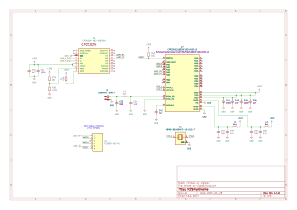
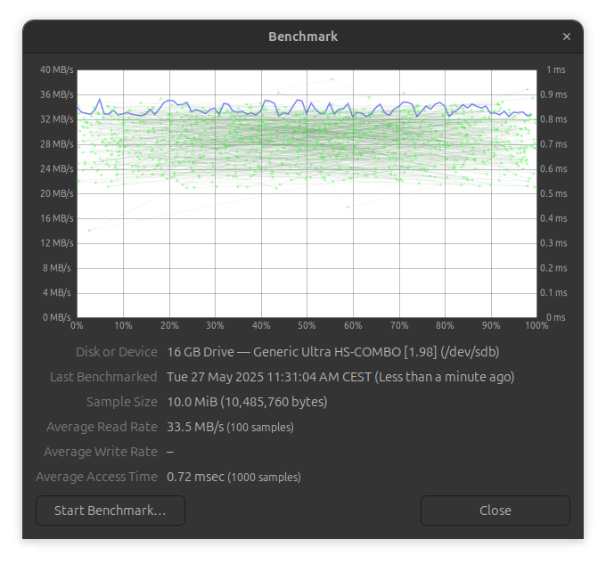

# M2SmartHome

## You are on development branch rev.1.1.0


## Overview

Setting up a smart home hub, such as running Home Assistant, often requires hardware with sufficient performance and connectivity options. Many existing solutions, like Raspberry Pi, may be insufficient for advanced automation tasks due to a low-power CPU or a slow microSD card on which the OS is installed. A good alternative could be an x86 mini PC, but these often lack expansion ports.  

M2SmartHome is an add-on card that operates on PCIe x1 and can be installed in any M.2 2280 Key M-equipped device. By integrating multiple essential components into a single device, it eliminates the need for external adapters and additional hardware.  

The device is equipped with onboard eMMC memory, an SD card reader, WiFi 802.11n 2.4GHz radio (RTL8188), and a Thread radio (EFR32) from Silicon Labs. Once installed in an M.2 slot, it provides both storage for the operating system and enhanced connectivity, making it an ideal choice for smart home setups.


This readme reffers to the Rev.1.0.0. 

## Features

- **Form Factor**: M.2 2280 Key M
- **Interface**: M.2 edge conenctor PCIe x1 
- **Storage**: Onboard eMMC, SD card reader
- **Wireless Connectivity**:
  - **WiFi**: 802.11n 2.4GHz (Realtek RTL8188)
  - **Thread Radio**: EFR32MG21 (Silicon Labs)


## Block diagram

On the diagram below siplified system architecture has been presented. PCIe x1 interface from host device is connected to PCIe bridge. To four USB 2.0 ports all crucial components are connected: eMMC memory controller, micro SD card controller, USB to UART bridge with Thread / ZigBee RF SOC and WiFi network card. 


### PCie to USB bridge
As a PCIe bridge choosen the `PI7C9X440SLBFDE` sold by Diodes Inc. (oryginally manufactured by Pericom). `7C9X440SLBFDE` is a PCIe-to-USB 2.0 host controller with a single x1 PCIe 1.1 interface, compliant with the PCIe Base Specification 1.1, supporting programmable driver current, de-emphasis levels, and advanced power management (L0, L0s, L1, L2, L2/L3Ready, L3, D0, D3Hot, D3Cold). It features four USB 2.0 ports with EHCI (480 Mbps) and OHCI (12 Mbps, 1.5 Mbps) controllers for high-, full-, and low-speed transactions. An EEPROM connected via I²C has been added to enable optional features and configurable settings.


[TODO] - add schematic

This part of the schematic has been highlighted in green on the board:


### eMMC memory with controller

The USB2244 is connected to a Pericom PCIe-to-USB bridge, acting as a USB 2.0-to-eMMC controller for Kingston’s EMMC16G-MW28-01E10, with a Microchip 24AA04T-I/OT EEPROM for optional configuration. The eMMC is powered directly from the M.2 3.3V rail, eliminating the need for an LDO. The eMMC interface uses D0–D8, CMD, and CLK lines, with 49.9kΩ pull-ups on CMD and data lines. The EEPROM is connected via I²C (SCL, SDA) with 4.7kΩ pull-ups, storing configuration settings for the USB controller. This setup provides high-speed eMMC access over USB in an M.2 form factor.


### micro SD card reader and controller

The USB2244 controller interfaces with a Hirose HRS_DM3AT-SF-PEJM5 push-in microSD card slot for USB-to-microSD storage access, with a Microchip 24AA04T-I/OT EEPROM for configuration storage. The microSD card is powered by the internal 3.3V regulator of the USB2244. The SD interface utilizes CLK, CMD, and D0–D3 lines, with 49.9kΩ pull-ups on CMD and data lines for stable operation. The EEPROM is connected via I²C (SCL, SDA) with 4.7kΩ pull-ups, allowing the USB2244 to load stored device settings at startup.


### Thread radio

The Silicon Labs EFR32MG21B020F1024IM32-B is a 802.15.4 Thread radio SoC, providing wireless connectivity, while the Silicon Labs CP2102N-A02-GQFN20 acts as a USB-to-UART bridge for communication with a host system. The EFR32MG21 is powered from the M.2 3.3V rail, with its radio interface using an external antenna for Thread communication. The CP2102N is connected via USB 2.0 (D+, D-) to the host via PCIe USB bridge. 




### WiFi radio

The Realtek RTL8188FTV-VC-CG is a WiFi 802.11b/g/n 2.4GHz radio SoC, providing wireless connectivity. It is powered from the M.2 3.3V rail and interfaces with the host system via a USB 2.0 connection. The RF section is connected to an external antenna. 


## Board design

Board dimensions
Board renders


##Manufacturing

Board has been manufactured 

Add stackup
Add impedance 
Board photos

## Board bring up 

Photos inside PC
Describe what works what not

### PCie USB bridge
This part of the device is not yet working properly. 

What already verified:
- proper supply voltages
- Stable oscillations on crystal
- PCIe REF CLK - stable 100 MHz at the IC
- Square signal on TX line from HOST
- Host trying to initialise the device - properly set M.2 channel configuration, `lspci` shows additional bridge when inserted card
- PERST is properly pulled low and high - host tries to initialise device and when restarting it hungs on boot, probably due to lack of response
- removing serial EEPROM
- pulling I2C data lines up and down, left floating (found in another IC that when flash not used data lines should be pulled down)

Current hypothesis:
- power sequencing
- lacking of some configuration pins pull-ups / pull-downs

### eMMC memory

This part has been tested by the removal of the series resistors on USB data lines and conencting this directly to USB port through cable, while beeing powered from M.2 port. eMMC memory is properly detected in the operating system, it is readable and writtable. Works without any issues during benchmarking and extended write test. Tested on HP 800 G3 SFF on Ubuntu 22.04.


`lsusb -d 0424:2240 -vvv`:
```bash
Bus 001 Device 008: ID 0424:2240 Microchip Technology, Inc. (formerly SMSC) Ultra Fast Media
Couldn't open device, some information will be missing
Device Descriptor:
bLength 18
bDescriptorType 1
bcdUSB 2.00
bDeviceClass 0 [unknown]
bDeviceSubClass 0 [unknown]
bDeviceProtocol 0
bMaxPacketSize0 64
idVendor 0x0424 Microchip Technology, Inc. (formerly SMSC)
idProduct 0x2240 Ultra Fast Media
bcdDevice 1.98
iManufacturer 1 Generic
iProduct 2 Ultra Fast Media
iSerial 3 000000225001
bNumConfigurations 1
Configuration Descriptor:
bLength 9
bDescriptorType 2
wTotalLength 0x0020
bNumInterfaces 1
bConfigurationValue 1
iConfiguration 0
bmAttributes 0x80
(Bus Powered)
MaxPower 96mA
Interface Descriptor:
bLength 9
bDescriptorType 4
bInterfaceNumber 0
bAlternateSetting 0
bNumEndpoints 2
bInterfaceClass 8 Mass Storage
bInterfaceSubClass 6 SCSI
bInterfaceProtocol 80 Bulk-Only
iInterface 0
Endpoint Descriptor:
bLength 7
bDescriptorType 5
bEndpointAddress 0x02 EP 2 OUT
bmAttributes 2
Transfer Type Bulk
Synch Type None
Usage Type Data
wMaxPacketSize 0x0200 1x 512 bytes
bInterval 1
Endpoint Descriptor:
bLength 7
bDescriptorType 5
bEndpointAddress 0x82 EP 2 IN
bmAttributes 2
Transfer Type Bulk
Synch Type None
Usage Type Data
wMaxPacketSize 0x0200 1x 512 bytes
bInterval 0

```

`lsblk`:
```bash
NAME MAJ:MIN RM SIZE RO TYPE MOUNTPOINTS
sdb 8:16 1 14.6G 0 disk
```

`dmesg`:
```bash
[ 2402.769465] usb 1-13: new high-speed USB device number 8 using xhci_hcd
[ 2402.902304] usb 1-13: New USB device found, idVendor=0424, idProduct=2240, bcdDevice= 1.98
[ 2402.902327] usb 1-13: New USB device strings: Mfr=1, Product=2, SerialNumber=3
[ 2402.902335] usb 1-13: Product: Ultra Fast Media
[ 2402.902341] usb 1-13: Manufacturer: Generic
[ 2402.902347] usb 1-13: SerialNumber: 000000225001
[ 2402.907570] usb-storage 1-13:1.0: USB Mass Storage device detected
[ 2402.907866] scsi host2: usb-storage 1-13:1.0
[ 2403.963071] scsi 2:0:0:0: Direct-Access Generic Ultra HS-COMBO 1.98 PQ: 0 ANSI: 0
[ 2403.963267] sd 2:0:0:0: Attached scsi generic sg1 type 0
[ 2403.969432] sd 2:0:0:0: [sdb] 30615552 512-byte logical blocks: (15.7 GB/14.6 GiB)
[ 2403.970000] sd 2:0:0:0: [sdb] Write Protect is off
[ 2403.970004] sd 2:0:0:0: [sdb] Mode Sense: 23 00 00 00
[ 2403.970608] sd 2:0:0:0: [sdb] No Caching mode page found
[ 2403.970611] sd 2:0:0:0: [sdb] Assuming drive cache: write through
[ 2403.974170] sd 2:0:0:0: [sdb] Attached SCSI removable disk
```

Benchmarked using Gnome Disks tool:


### uSD reader

This part has been tested by the removal of the series resistors on USB data lines and conencting this directly to USB port through cable, while beeing powered from M.2 port. Various micro SD cards are properly detected in the operating system, they are readable and writtable. Works without any issues during benchmarking and extended write test. Tested on HP 800 G3 SFF on Ubuntu 22.04.

`lsusb -d 0424:2240 -vvv`:
```bash
Bus 001 Device 005: ID 0424:2240 Microchip Technology, Inc. (formerly SMSC) Ultra Fast Media
Couldn't open device, some information will be missing
Device Descriptor:
bLength 18
bDescriptorType 1
bcdUSB 2.00
bDeviceClass 0 [unknown]
bDeviceSubClass 0 [unknown]
bDeviceProtocol 0
bMaxPacketSize0 64
idVendor 0x0424 Microchip Technology, Inc. (formerly SMSC)
idProduct 0x2240 Ultra Fast Media
bcdDevice 1.98
iManufacturer 1 Generic
iProduct 2 Ultra Fast Media
iSerial 3 000000225001
bNumConfigurations 1
Configuration Descriptor:
bLength 9
bDescriptorType 2
wTotalLength 0x0020
bNumInterfaces 1
bConfigurationValue 1
iConfiguration 0
bmAttributes 0x80
(Bus Powered)
MaxPower 96mA
Interface Descriptor:
bLength 9
bDescriptorType 4
bInterfaceNumber 0
bAlternateSetting 0
bNumEndpoints 2
bInterfaceClass 8 Mass Storage
bInterfaceSubClass 6 SCSI
bInterfaceProtocol 80 Bulk-Only
iInterface 0
Endpoint Descriptor:
bLength 7
bDescriptorType 5
bEndpointAddress 0x02 EP 2 OUT
bmAttributes 2
Transfer Type Bulk
Synch Type None
Usage Type Data
wMaxPacketSize 0x0200 1x 512 bytes
bInterval 1
Endpoint Descriptor:
bLength 7
bDescriptorType 5
bEndpointAddress 0x82 EP 2 IN
bmAttributes 2
Transfer Type Bulk
Synch Type None
Usage Type Data
wMaxPacketSize 0x0200 1x 512 bytes
bInterval 0
```

`lsblk`:
```bash
NAME MAJ:MIN RM SIZE RO TYPE MOUNTPOINTS
sdb 8:16 1 3.7G 0 disk
└─sdb1 8:17 1 3.7G 0 part /media/user/9016-4EF8
```

`dmesg` with connected just empty reader:
```bash
[ 33.892694] usb 1-13: new high-speed USB device number 5 using xhci_hcd
[ 34.027971] usb 1-13: New USB device found, idVendor=0424, idProduct=2240, bcdDevice= 1.98
[ 34.027977] usb 1-13: New USB device strings: Mfr=1, Product=2, SerialNumber=3
[ 34.027979] usb 1-13: Product: Ultra Fast Media
[ 34.027981] usb 1-13: Manufacturer: Generic
[ 34.027983] usb 1-13: SerialNumber: 000000225001
[ 34.051629] usb-storage 1-13:1.0: USB Mass Storage device detected
[ 34.051918] scsi host2: usb-storage 1-13:1.0
[ 34.052013] usbcore: registered new interface driver usb-storage
[ 34.054051] usbcore: registered new interface driver uas
[ 35.074189] scsi 2:0:0:0: Direct-Access Generic Ultra HS-COMBO 1.98 PQ: 0 ANSI: 0
[ 35.074516] sd 2:0:0:0: Attached scsi generic sg1 type 0
[ 35.075325] sd 2:0:0:0: [sdb] Media removed, stopped polling
[ 35.075721] sd 2:0:0:0: [sdb] Attached SCSI removable disk
```


`dmesg` when inserted 4GB micro SD card:
```bash
[ 651.529877] sd 2:0:0:0: [sdb] 7759872 512-byte logical blocks: (3.97 GB/3.70 GiB)
[ 651.531210] sdb: detected capacity change from 0 to 7759872
[ 651.532979] sdb: sdb1
```

Benchmarked using Gnome Disks tool. Tested 3 different uSD cards. 
1. Off brand 4GB class 4 micro SD card 


2. ATP 1GB SLC industrial micro SD card:


3. San Disk Extreme 32GB class Ultra 3:


### Thread radio

To be described.

### WiFi radio

To be described.


### Firmware

Custom firmware is not yet ready.


## Repository Structure

This repository contains the following directories:

- `hardware-electronics` - Kicad 8 project (schematic, board and libraries) 
- `images` - contains photos and reders used in this README
- `firmware` - contains flash binary files for custom devices configurations
